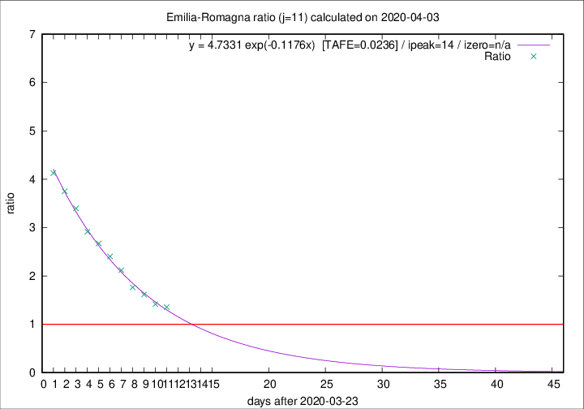

# Emilia-Romagna

Data source: https://raw.githubusercontent.com/pcm-dpc/COVID-19/master/dati-json/dpc-covid19-ita-regioni.json

Delta days analysis (j): 11

Analyses for other values of j for 2020-04-03 are avalable [here](../2020-04-03/README.md)

Analyses for Emilia-Romagna for previous dates are avalable [here](../README.md)

## Fitting 
|fit type|best fit equation|tafe|tfe|ipeak|izero|
|-------|-----|--------|------|---|---|
|exp|y = 4.7331 exp(-0.1176x)  [TAFE=0.0236]|0.0236|0.0005|14|n/a|

## Data
|Date|Daily deaths|Cumulated deaths|Deaths in the last 11 days|Deaths in the 11 days before|ratio|
|----|----------|-----------|-------|--------------------|-----|
|2020-04-03|91|1902|1010|746|1.3539|
|2020-04-02|79|1811|995|703|1.4154|
|2020-04-01|88|1732|1017|630|1.6143|
|2020-03-31|106|1644|1004|570|1.7614|
|2020-03-30|95|1538|1007|475|2.1200|
|2020-03-29|99|1443|985|410|2.4024|
|2020-03-28|77|1344|951|356|2.6713|
|2020-03-27|93|1267|921|316|2.9146|
|2020-03-26|97|1174|890|262|3.3969|
|2020-03-25|92|1077|836|223|3.7489|
|2020-03-24|93|985|784|190|4.1263|

[Download data as CSV](COVID-19_emilia-romagna_j11_2020-04-03.csv)

Generated April 19th, 2020 at 18:42:39 UTC+0200 with https://github.com/robianc/COVID-19
