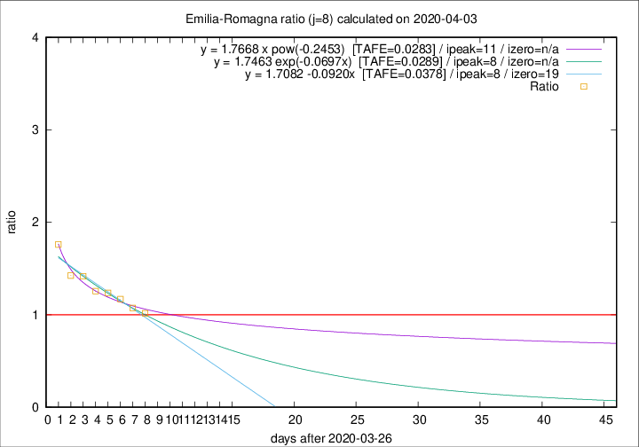

# Emilia-Romagna

Data source: https://raw.githubusercontent.com/pcm-dpc/COVID-19/master/dati-json/dpc-covid19-ita-regioni.json

Delta days analysis (j): 8

## Fitting 
|fit type|best fit equation|tafe|tfe|ipeak|izero|
|-------|-----|--------|------|---|---|
|linear|y = 1.7082 -0.0920x  [TAFE=0.0378]|0.0378|0.0015|8|19|
|exp|y = 1.7463 exp(-0.0697x)  [TAFE=0.0289]|0.0289|0.0007|8|n/a|
|pow|y = 1.7668 x pow(-0.2453)  [TAFE=0.0283]|0.0283|0.0006|11|n/a|

## Data
|Date|Daily deaths|Cumulated deaths|Deaths in the last 8 days|Deaths in the 8 days before|ratio|
|----|----------|-----------|-------|--------------------|-----|
|2020-04-03|91|1902|728|716|1.0168|
|2020-04-02|79|1811|734|684|1.0731|
|2020-04-01|88|1732|747|639|1.1690|
|2020-03-31|106|1644|752|608|1.2368|
|2020-03-30|95|1538|722|575|1.2557|
|2020-03-29|99|1443|728|514|1.4163|
|2020-03-28|77|1344|704|494|1.4251|
|2020-03-27|93|1267|736|418|1.7608|

[Download data as CSV](COVID-19_emilia-romagna_j8_2020-04-03.csv)

Generated April 9th, 2020 at 16:40:48 UTC+0200 with https://github.com/robianc/COVID-19
