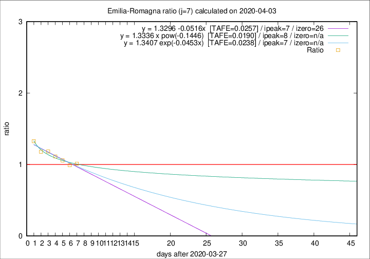

# Emilia-Romagna

Data source: https://raw.githubusercontent.com/pcm-dpc/COVID-19/master/dati-json/dpc-covid19-ita-regioni.json

Estimates in this page were made on 14/4/2020 with data available until 03/04/2020.

## Summary 

### Peak estimate 
|j|linear [TAFE]|exponential [TAFE]|power law [TAFE]|details|
|---|----|-----------|---------|-------|
|7|4/4/2020 [TAFE=0.0257]|4/4/2020 [TAFE=0.0238]|5/4/2020 [TAFE=0.0190]|[analysis](COVID-19_emilia-romagna_j7_2020-04-03.md)|
|8|4/4/2020 [TAFE=0.0378]|4/4/2020 [TAFE=0.0289]|7/4/2020 [TAFE=0.0283]|[analysis](COVID-19_emilia-romagna_j8_2020-04-03.md)|
|9|4/4/2020 [TAFE=0.0632]|5/4/2020 [TAFE=0.0408]|10/4/2020 [TAFE=0.0339]|[analysis](COVID-19_emilia-romagna_j9_2020-04-03.md)|
|10|5/4/2020 [TAFE=0.0688]|6/4/2020 [TAFE=0.0360]|14/4/2020 [TAFE=0.0698]|[analysis](COVID-19_emilia-romagna_j10_2020-04-03.md)|
|11|5/4/2020 [TAFE=0.0575]|7/4/2020 [TAFE=0.0236]|21/4/2020 [TAFE=0.1154]|[analysis](COVID-19_emilia-romagna_j11_2020-04-03.md)|
|12|4/4/2020 [TAFE=0.1262]|7/4/2020 [TAFE=0.0407]|25/4/2020 [TAFE=0.1129]|[analysis](COVID-19_emilia-romagna_j12_2020-04-03.md)|
|13|4/4/2020 [TAFE=0.2052]|8/4/2020 [TAFE=0.0534]|1/5/2020 [TAFE=0.1269]|[analysis](COVID-19_emilia-romagna_j13_2020-04-03.md)|
|14|-|-|-||

Best estimator is pow with j=7 (TAFE=0.0190)
Corresponding peak date estimate is 5/4/2020 (ipeak 8)

Peak date range estimate: 28/3/2020 - 7/5/2020

### End estimate 
|j|linear [TAFE/TFE]|exponential [TAFE/TFE]|power law [TAFE/TFE]|details|
|---|----|-----------|---------|-------|
|7|23/4/2020 [TAFE=0.0257]|-|-|[analysis](COVID-19_emilia-romagna_j7_2020-04-03.md)|
|8|-|-|-|[analysis](COVID-19_emilia-romagna_j8_2020-04-03.md)|
|9|-|-|-|[analysis](COVID-19_emilia-romagna_j9_2020-04-03.md)|
|10|-|-|-|[analysis](COVID-19_emilia-romagna_j10_2020-04-03.md)|
|11|-|-|-|[analysis](COVID-19_emilia-romagna_j11_2020-04-03.md)|
|12|-|-|-|[analysis](COVID-19_emilia-romagna_j12_2020-04-03.md)|
|13|-|-|-|[analysis](COVID-19_emilia-romagna_j13_2020-04-03.md)|
|14|-|-|-||

Best estimator is linear with j=7 (TAFE=0.0257)
Corresponding end date estimate is 23/4/2020 (izero 26)

End date range estimate: 28/3/2020 - 23/4/2020

Generated April 14th, 2020 at 19:16:04 UTC+0200 with https://github.com/robianc/COVID-19
