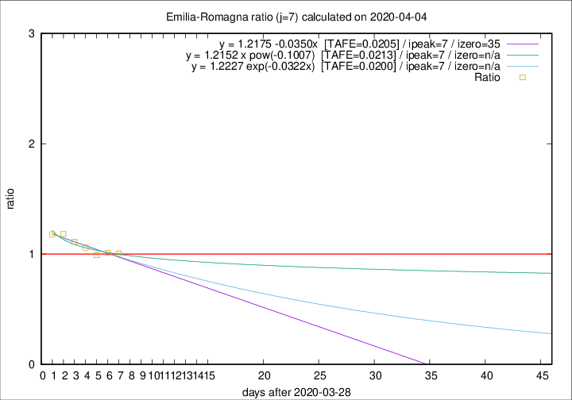

# Emilia-Romagna

Data source: https://raw.githubusercontent.com/pcm-dpc/COVID-19/master/dati-json/dpc-covid19-ita-regioni.json

Delta days analysis (j): 7

Analyses for other values of j for 2020-04-04 are avalable [here](../2020-04-04/README.md)

Analyses for Emilia-Romagna for previous dates are avalable [here](../README.md)

## Fitting 
|fit type|best fit equation|tafe|tfe|ipeak|izero|
|-------|-----|--------|------|---|---|
|linear|y = 1.2175 -0.0350x  [TAFE=0.0205]|0.0205|0.0006|7|35|
|exp|y = 1.2227 exp(-0.0322x)  [TAFE=0.0200]|0.0200|0.0003|7|n/a|
|pow|y = 1.2152 x pow(-0.1007)  [TAFE=0.0213]|0.0213|0.0004|7|n/a|

## Data
|Date|Daily deaths|Cumulated deaths|Deaths in the last 7 days|Deaths in the 7 days before|ratio|
|----|----------|-----------|-------|--------------------|-----|
|2020-04-04|75|1977|633|629|1.0064|
|2020-04-03|91|1902|635|627|1.0128|
|2020-04-02|79|1811|637|643|0.9907|
|2020-04-01|88|1732|655|619|1.0582|
|2020-03-31|106|1644|659|592|1.1132|
|2020-03-30|95|1538|646|546|1.1832|
|2020-03-29|99|1443|627|532|1.1786|

[Download data as CSV](COVID-19_emilia-romagna_j7_2020-04-04.csv)

Generated April 12th, 2020 at 17:02:01 UTC+0200 with https://github.com/robianc/COVID-19
