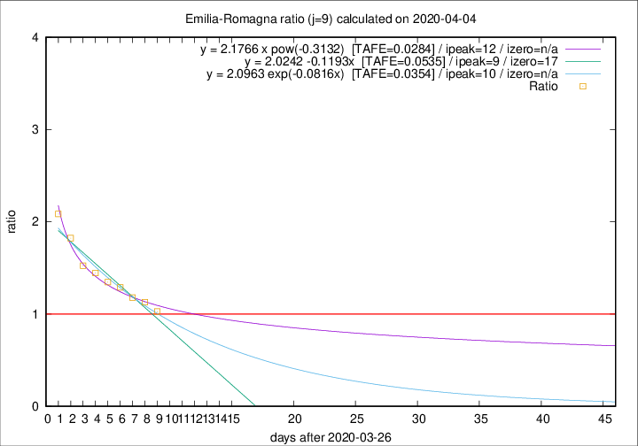

# Emilia-Romagna

Data source: https://raw.githubusercontent.com/pcm-dpc/COVID-19/master/dati-json/dpc-covid19-ita-regioni.json

Delta days analysis (j): 9

## Fitting 
|fit type|best fit equation|tafe|tfe|ipeak|izero|
|-------|-----|--------|------|---|---|
|linear|y = 2.0242 -0.1193x  [TAFE=0.0535]|0.0535|0.0014|9|17|
|exp|y = 2.0963 exp(-0.0816x)  [TAFE=0.0354]|0.0354|0.0008|10|n/a|
|pow|y = 2.1766 x pow(-0.3132)  [TAFE=0.0284]|0.0284|0.0005|12|n/a|

## Data
|Date|Daily deaths|Cumulated deaths|Deaths in the last 9 days|Deaths in the 9 days before|ratio|
|----|----------|-----------|-------|--------------------|-----|
|2020-04-04|75|1977|803|781|1.0282|
|2020-04-03|91|1902|825|731|1.1286|
|2020-04-02|79|1811|826|701|1.1783|
|2020-04-01|88|1732|840|651|1.2903|
|2020-03-31|106|1644|828|615|1.3463|
|2020-03-30|95|1538|823|569|1.4464|
|2020-03-29|99|1443|803|527|1.5237|
|2020-03-28|77|1344|813|446|1.8229|
|2020-03-27|93|1267|809|388|2.0851|

[Download data as CSV](COVID-19_emilia-romagna_j9_2020-04-04.csv)

Generated April 9th, 2020 at 16:40:48 UTC+0200 with https://github.com/robianc/COVID-19
