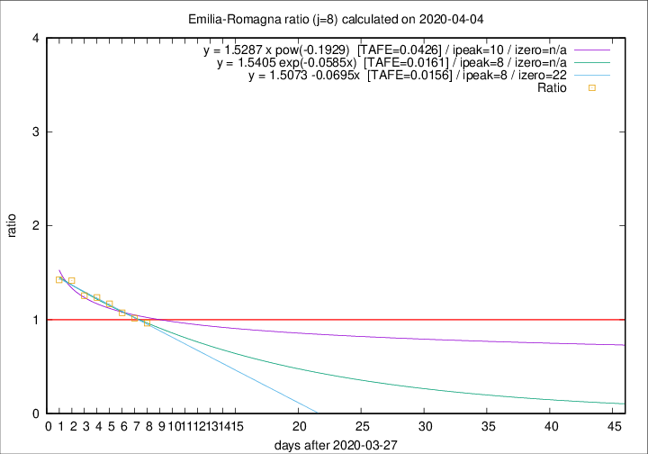

# Emilia-Romagna

Data source: https://raw.githubusercontent.com/pcm-dpc/COVID-19/master/dati-json/dpc-covid19-ita-regioni.json

Estimates in this page were made on 16/4/2020 with data available until 04/04/2020.

## Summary 

### Peak estimate 
|j|linear [TAFE]|exponential [TAFE]|power law [TAFE]|details|
|---|----|-----------|---------|-------|
|7|5/4/2020 [TAFE=0.0205]|5/4/2020 [TAFE=0.0200]|5/4/2020 [TAFE=0.0213]|[analysis](COVID-19_emilia-romagna_j7_2020-04-04.md)|
|8|5/4/2020 [TAFE=0.0156]|5/4/2020 [TAFE=0.0161]|7/4/2020 [TAFE=0.0426]|[analysis](COVID-19_emilia-romagna_j8_2020-04-04.md)|
|9|5/4/2020 [TAFE=0.0535]|6/4/2020 [TAFE=0.0354]|8/4/2020 [TAFE=0.0284]|[analysis](COVID-19_emilia-romagna_j9_2020-04-04.md)|
|10|5/4/2020 [TAFE=0.0686]|6/4/2020 [TAFE=0.0390]|12/4/2020 [TAFE=0.0622]|[analysis](COVID-19_emilia-romagna_j10_2020-04-04.md)|
|11|5/4/2020 [TAFE=0.0758]|7/4/2020 [TAFE=0.0292]|17/4/2020 [TAFE=0.0959]|[analysis](COVID-19_emilia-romagna_j11_2020-04-04.md)|
|12|5/4/2020 [TAFE=0.0989]|8/4/2020 [TAFE=0.0340]|22/4/2020 [TAFE=0.1180]|[analysis](COVID-19_emilia-romagna_j12_2020-04-04.md)|
|13|5/4/2020 [TAFE=0.1896]|8/4/2020 [TAFE=0.0526]|26/4/2020 [TAFE=0.1205]|[analysis](COVID-19_emilia-romagna_j13_2020-04-04.md)|
|14|-|-|-||

Best estimator is linear with j=8 (TAFE=0.0156)
Corresponding peak date estimate is 5/4/2020 (ipeak 8)

Peak date range estimate: 28/3/2020 - 1/5/2020

### End estimate 
|j|linear [TAFE/TFE]|exponential [TAFE/TFE]|power law [TAFE/TFE]|details|
|---|----|-----------|---------|-------|
|7|3/5/2020 [TAFE=0.0205]|-|-|[analysis](COVID-19_emilia-romagna_j7_2020-04-04.md)|
|8|19/4/2020 [TAFE=0.0156]|-|-|[analysis](COVID-19_emilia-romagna_j8_2020-04-04.md)|
|9|-|-|-|[analysis](COVID-19_emilia-romagna_j9_2020-04-04.md)|
|10|-|-|-|[analysis](COVID-19_emilia-romagna_j10_2020-04-04.md)|
|11|-|-|-|[analysis](COVID-19_emilia-romagna_j11_2020-04-04.md)|
|12|-|-|-|[analysis](COVID-19_emilia-romagna_j12_2020-04-04.md)|
|13|-|-|-|[analysis](COVID-19_emilia-romagna_j13_2020-04-04.md)|
|14|-|-|-||

Best estimator is linear with j=8 (TAFE=0.0156)
Corresponding end date estimate is 19/4/2020 (izero 22)

End date range estimate: 28/3/2020 - 2/5/2020

Generated April 16th, 2020 at 20:09:19 UTC+0200 with https://github.com/robianc/COVID-19
