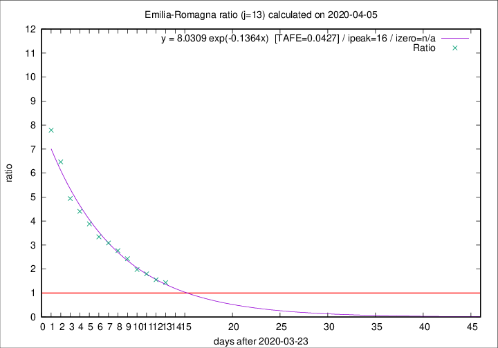

# Emilia-Romagna

Data source: https://raw.githubusercontent.com/pcm-dpc/COVID-19/master/dati-json/dpc-covid19-ita-regioni.json

Delta days analysis (j): 13

Analyses for other values of j for 2020-04-05 are avalable [here](../2020-04-05/README.md)

Analyses for Emilia-Romagna for previous dates are avalable [here](../README.md)

## Fitting 
|fit type|best fit equation|tafe|tfe|ipeak|izero|
|-------|-----|--------|------|---|---|
|exp|y = 8.0309 exp(-0.1364x)  [TAFE=0.0427]|0.0427|0.0012|16|n/a|

## Data
|Date|Daily deaths|Cumulated deaths|Deaths in the last 13 days|Deaths in the 13 days before|ratio|
|----|----------|-----------|-------|--------------------|-----|
|2020-04-05|74|2051|1159|807|1.4362|
|2020-04-04|75|1977|1161|746|1.5563|
|2020-04-03|91|1902|1187|659|1.8012|
|2020-04-02|79|1811|1171|592|1.9780|
|2020-04-01|88|1732|1201|494|2.4312|
|2020-03-31|106|1644|1186|428|2.7710|
|2020-03-30|95|1538|1145|371|3.0863|
|2020-03-29|99|1443|1097|328|3.3445|
|2020-03-28|77|1344|1060|273|3.8828|
|2020-03-27|93|1267|1026|233|4.4034|
|2020-03-26|97|1174|973|197|4.9391|
|2020-03-25|92|1077|931|144|6.4653|
|2020-03-24|93|985|872|112|7.7857|

[Download data as CSV](COVID-19_emilia-romagna_j13_2020-04-05.csv)

Generated April 16th, 2020 at 20:09:19 UTC+0200 with https://github.com/robianc/COVID-19
