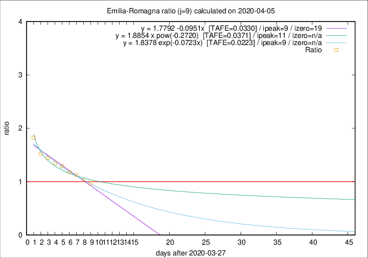

# Emilia-Romagna

Data source: https://raw.githubusercontent.com/pcm-dpc/COVID-19/master/dati-json/dpc-covid19-ita-regioni.json

Delta days analysis (j): 9

Analyses for other values of j for 2020-04-05 are avalable [here](../2020-04-05/README.md)

Analyses for Emilia-Romagna for previous dates are avalable [here](../README.md)

## Fitting 
|fit type|best fit equation|tafe|tfe|ipeak|izero|
|-------|-----|--------|------|---|---|
|linear|y = 1.7792 -0.0951x  [TAFE=0.0330]|0.0330|0.0005|9|19|
|exp|y = 1.8378 exp(-0.0723x)  [TAFE=0.0223]|0.0223|0.0003|9|n/a|
|pow|y = 1.8854 x pow(-0.2720)  [TAFE=0.0371]|0.0371|0.0009|11|n/a|

## Data
|Date|Daily deaths|Cumulated deaths|Deaths in the last 9 days|Deaths in the 9 days before|ratio|
|----|----------|-----------|-------|--------------------|-----|
|2020-04-05|74|2051|784|809|0.9691|
|2020-04-04|75|1977|803|781|1.0282|
|2020-04-03|91|1902|825|731|1.1286|
|2020-04-02|79|1811|826|701|1.1783|
|2020-04-01|88|1732|840|651|1.2903|
|2020-03-31|106|1644|828|615|1.3463|
|2020-03-30|95|1538|823|569|1.4464|
|2020-03-29|99|1443|803|527|1.5237|
|2020-03-28|77|1344|813|446|1.8229|

[Download data as CSV](COVID-19_emilia-romagna_j9_2020-04-05.csv)

Generated April 14th, 2020 at 19:16:04 UTC+0200 with https://github.com/robianc/COVID-19
