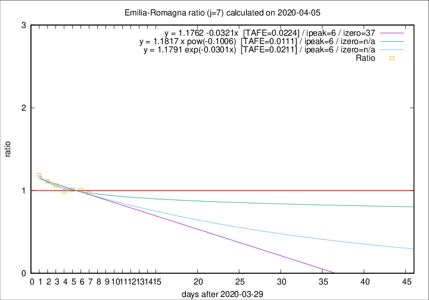

# Emilia-Romagna

Data source: https://raw.githubusercontent.com/pcm-dpc/COVID-19/master/dati-json/dpc-covid19-ita-regioni.json

Estimates in this page were made on 12/4/2020 with data available until 05/04/2020.

## Summary 

### Peak estimate 
|j|linear [TAFE]|exponential [TAFE]|power law [TAFE]|details|
|---|----|-----------|---------|-------|
|7|5/4/2020 [TAFE=0.0224]|5/4/2020 [TAFE=0.0211]|5/4/2020 [TAFE=0.0111]|[analysis](COVID-19_emilia-romagna_j7_2020-04-05.md)|
|8|5/4/2020 [TAFE=0.0313]|5/4/2020 [TAFE=0.0289]|6/4/2020 [TAFE=0.0264]|[analysis](COVID-19_emilia-romagna_j8_2020-04-05.md)|
|9|6/4/2020 [TAFE=0.0330]|6/4/2020 [TAFE=0.0223]|8/4/2020 [TAFE=0.0371]|[analysis](COVID-19_emilia-romagna_j9_2020-04-05.md)|
|10|6/4/2020 [TAFE=0.0717]|7/4/2020 [TAFE=0.0424]|10/4/2020 [TAFE=0.0400]|[analysis](COVID-19_emilia-romagna_j10_2020-04-05.md)|
|11|6/4/2020 [TAFE=0.0777]|7/4/2020 [TAFE=0.0350]|14/4/2020 [TAFE=0.0783]|[analysis](COVID-19_emilia-romagna_j11_2020-04-05.md)|
|12|6/4/2020 [TAFE=0.0821]|8/4/2020 [TAFE=0.0276]|20/4/2020 [TAFE=0.1217]|[analysis](COVID-19_emilia-romagna_j12_2020-04-05.md)|
|13|6/4/2020 [TAFE=0.1594]|9/4/2020 [TAFE=0.0427]|24/4/2020 [TAFE=0.1246]|[analysis](COVID-19_emilia-romagna_j13_2020-04-05.md)|
|14|5/4/2020 [TAFE=0.2444]|9/4/2020 [TAFE=0.0554]|29/4/2020 [TAFE=0.1486]|[analysis](COVID-19_emilia-romagna_j14_2020-04-05.md)|

Best estimator is pow with j=7 (TAFE=0.0111)
Corresponding peak date estimate is 5/4/2020 (ipeak 6)

Peak date range estimate: 5/4/2020 - 6/5/2020

### End estimate 
|j|linear [TAFE/TFE]|exponential [TAFE/TFE]|power law [TAFE/TFE]|details|
|---|----|-----------|---------|-------|
|7|6/5/2020 [TAFE=0.0224]|-|-|[analysis](COVID-19_emilia-romagna_j7_2020-04-05.md)|
|8|-|-|-|[analysis](COVID-19_emilia-romagna_j8_2020-04-05.md)|
|9|-|-|-|[analysis](COVID-19_emilia-romagna_j9_2020-04-05.md)|
|10|-|-|-|[analysis](COVID-19_emilia-romagna_j10_2020-04-05.md)|
|11|-|-|-|[analysis](COVID-19_emilia-romagna_j11_2020-04-05.md)|
|12|-|-|-|[analysis](COVID-19_emilia-romagna_j12_2020-04-05.md)|
|13|-|-|-|[analysis](COVID-19_emilia-romagna_j13_2020-04-05.md)|
|14|-|-|-|[analysis](COVID-19_emilia-romagna_j14_2020-04-05.md)|

Best estimator is linear with j=7 (TAFE=0.0224)
Corresponding end date estimate is 6/5/2020 (izero 37)

End date range estimate: 30/3/2020 - 6/5/2020

Generated April 12th, 2020 at 17:02:01 UTC+0200 with https://github.com/robianc/COVID-19
