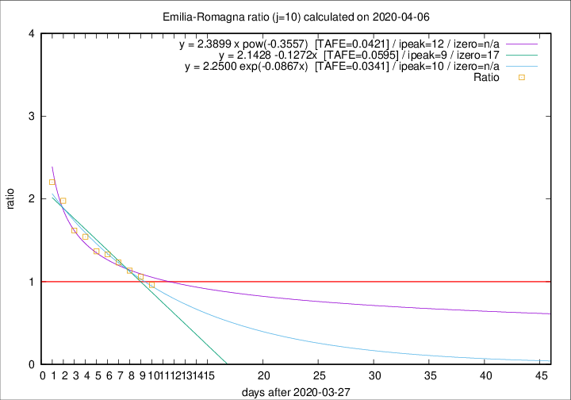

# Emilia-Romagna

Data source: https://raw.githubusercontent.com/pcm-dpc/COVID-19/master/dati-json/dpc-covid19-ita-regioni.json

Delta days analysis (j): 10

## Fitting 
|fit type|best fit equation|tafe|tfe|ipeak|izero|
|-------|-----|--------|------|---|---|
|linear|y = 2.1428 -0.1272x  [TAFE=0.0595]|0.0595|0.0011|9|17|
|exp|y = 2.2500 exp(-0.0867x)  [TAFE=0.0341]|0.0341|0.0009|10|n/a|
|pow|y = 2.3899 x pow(-0.3557)  [TAFE=0.0421]|0.0421|0.0013|12|n/a|

## Data
|Date|Daily deaths|Cumulated deaths|Deaths in the last 10 days|Deaths in the 10 days before|ratio|
|----|----------|-----------|-------|--------------------|-----|
|2020-04-06|57|2108|841|874|0.9622|
|2020-04-05|74|2051|877|828|1.0592|
|2020-04-04|75|1977|900|793|1.1349|
|2020-04-03|91|1902|917|744|1.2325|
|2020-04-02|79|1811|919|691|1.3300|
|2020-04-01|88|1732|916|670|1.3672|
|2020-03-31|106|1644|929|602|1.5432|
|2020-03-30|95|1538|898|555|1.6180|
|2020-03-29|99|1443|912|461|1.9783|
|2020-03-28|77|1344|886|402|2.2040|

[Download data as CSV](COVID-19_emilia-romagna_j10_2020-04-06.csv)

Generated April 8th, 2020 at 23:43:36 UTC+0200 with https://github.com/robianc/COVID-19
