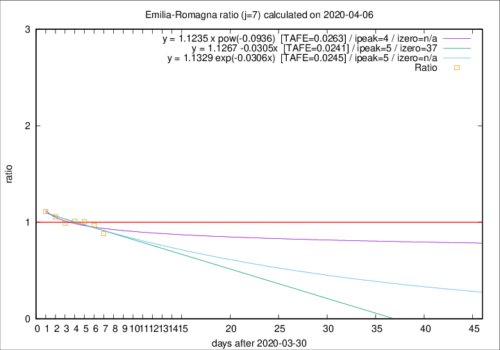

# Emilia-Romagna

Data source: https://raw.githubusercontent.com/pcm-dpc/COVID-19/master/dati-json/dpc-covid19-ita-regioni.json

Delta days analysis (j): 7

Analyses for other values of j for 2020-04-06 are avalable [here](../2020-04-06/README.md)

Analyses for Emilia-Romagna for previous dates are avalable [here](../README.md)

## Fitting 
|fit type|best fit equation|tafe|tfe|ipeak|izero|
|-------|-----|--------|------|---|---|
|linear|y = 1.1267 -0.0305x  [TAFE=0.0241]|0.0241|0.0007|5|37|
|exp|y = 1.1329 exp(-0.0306x)  [TAFE=0.0245]|0.0245|0.0003|5|n/a|
|pow|y = 1.1235 x pow(-0.0936)  [TAFE=0.0263]|0.0263|0.0005|4|n/a|

## Data
|Date|Daily deaths|Cumulated deaths|Deaths in the last 7 days|Deaths in the 7 days before|ratio|
|----|----------|-----------|-------|--------------------|-----|
|2020-04-06|57|2108|570|646|0.8824|
|2020-04-05|74|2051|608|627|0.9697|
|2020-04-04|75|1977|633|629|1.0064|
|2020-04-03|91|1902|635|627|1.0128|
|2020-04-02|79|1811|637|643|0.9907|
|2020-04-01|88|1732|655|619|1.0582|
|2020-03-31|106|1644|659|592|1.1132|

[Download data as CSV](COVID-19_emilia-romagna_j7_2020-04-06.csv)

Generated April 12th, 2020 at 17:02:01 UTC+0200 with https://github.com/robianc/COVID-19
