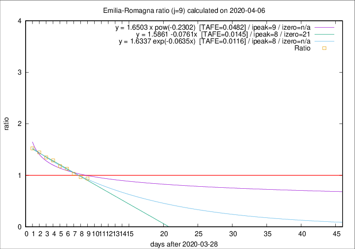

# Emilia-Romagna

Data source: https://raw.githubusercontent.com/pcm-dpc/COVID-19/master/dati-json/dpc-covid19-ita-regioni.json

Estimates in this page were made on 12/4/2020 with data available until 06/04/2020.

## Summary 

### Peak estimate 
|j|linear [TAFE]|exponential [TAFE]|power law [TAFE]|details|
|---|----|-----------|---------|-------|
|7|5/4/2020 [TAFE=0.0241]|5/4/2020 [TAFE=0.0245]|4/4/2020 [TAFE=0.0263]|[analysis](COVID-19_emilia-romagna_j7_2020-04-06.md)|
|8|6/4/2020 [TAFE=0.0258]|6/4/2020 [TAFE=0.0236]|5/4/2020 [TAFE=0.0337]|[analysis](COVID-19_emilia-romagna_j8_2020-04-06.md)|
|9|6/4/2020 [TAFE=0.0145]|6/4/2020 [TAFE=0.0116]|7/4/2020 [TAFE=0.0482]|[analysis](COVID-19_emilia-romagna_j9_2020-04-06.md)|
|10|6/4/2020 [TAFE=0.0595]|7/4/2020 [TAFE=0.0341]|9/4/2020 [TAFE=0.0421]|[analysis](COVID-19_emilia-romagna_j10_2020-04-06.md)|
|11|7/4/2020 [TAFE=0.0806]|8/4/2020 [TAFE=0.0384]|12/4/2020 [TAFE=0.0721]|[analysis](COVID-19_emilia-romagna_j11_2020-04-06.md)|
|12|7/4/2020 [TAFE=0.0917]|8/4/2020 [TAFE=0.0328]|17/4/2020 [TAFE=0.1074]|[analysis](COVID-19_emilia-romagna_j12_2020-04-06.md)|
|13|7/4/2020 [TAFE=0.1221]|9/4/2020 [TAFE=0.0342]|22/4/2020 [TAFE=0.1282]|[analysis](COVID-19_emilia-romagna_j13_2020-04-06.md)|
|14|6/4/2020 [TAFE=0.2282]|10/4/2020 [TAFE=0.0540]|25/4/2020 [TAFE=0.1366]|[analysis](COVID-19_emilia-romagna_j14_2020-04-06.md)|

Best estimator is exp with j=9 (TAFE=0.0116)
Corresponding peak date estimate is 6/4/2020 (ipeak 8)

Peak date range estimate: 2/4/2020 - 30/4/2020

### End estimate 
|j|linear [TAFE/TFE]|exponential [TAFE/TFE]|power law [TAFE/TFE]|details|
|---|----|-----------|---------|-------|
|7|7/5/2020 [TAFE=0.0241]|-|-|[analysis](COVID-19_emilia-romagna_j7_2020-04-06.md)|
|8|-|-|-|[analysis](COVID-19_emilia-romagna_j8_2020-04-06.md)|
|9|19/4/2020 [TAFE=0.0145]|-|-|[analysis](COVID-19_emilia-romagna_j9_2020-04-06.md)|
|10|-|-|-|[analysis](COVID-19_emilia-romagna_j10_2020-04-06.md)|
|11|-|-|-|[analysis](COVID-19_emilia-romagna_j11_2020-04-06.md)|
|12|-|-|-|[analysis](COVID-19_emilia-romagna_j12_2020-04-06.md)|
|13|-|-|-|[analysis](COVID-19_emilia-romagna_j13_2020-04-06.md)|
|14|-|-|-|[analysis](COVID-19_emilia-romagna_j14_2020-04-06.md)|

Best estimator is linear with j=9 (TAFE=0.0145)
Corresponding end date estimate is 19/4/2020 (izero 21)

End date range estimate: 29/3/2020 - 5/5/2020

Generated April 12th, 2020 at 17:02:01 UTC+0200 with https://github.com/robianc/COVID-19
