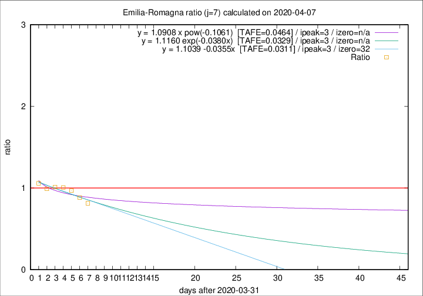

# Emilia-Romagna

Data source: https://raw.githubusercontent.com/pcm-dpc/COVID-19/master/dati-json/dpc-covid19-ita-regioni.json

Delta days analysis (j): 7

Analyses for other values of j for 2020-04-07 are avalable [here](../README.md)

Analyses for Emilia-Romagna for previous dates are avalable [here](../../README.md)

## Fitting 
|fit type|best fit equation|tafe|tfe|ipeak|izero|
|-------|-----|--------|------|---|---|
|linear|y = 1.1039 -0.0355x  [TAFE=0.0311]|0.0311|0.0014|3|32|
|exp|y = 1.1160 exp(-0.0380x)  [TAFE=0.0329]|0.0329|0.0008|3|n/a|
|pow|y = 1.0908 x pow(-0.1061)  [TAFE=0.0464]|0.0464|0.0014|3|n/a|

## Data
|Date|Daily deaths|Cumulated deaths|Deaths in the last 7 days|Deaths in the 7 days before|ratio|
|----|----------|-----------|-------|--------------------|-----|
|2020-04-07|72|2180|536|659|0.8134|
|2020-04-06|57|2108|570|646|0.8824|
|2020-04-05|74|2051|608|627|0.9697|
|2020-04-04|75|1977|633|629|1.0064|
|2020-04-03|91|1902|635|627|1.0128|
|2020-04-02|79|1811|637|643|0.9907|
|2020-04-01|88|1732|655|619|1.0582|

[Download data as CSV](COVID-19_emilia-romagna_j7_2020-04-07.csv)

Generated April 12th, 2020 at 16:28:18 UTC+0200 with https://github.com/robianc/COVID-19
