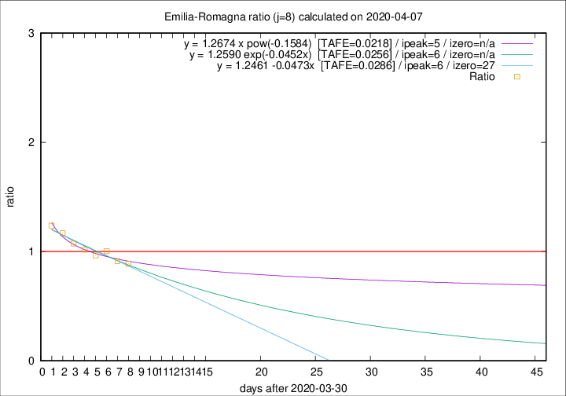

# Emilia-Romagna

Data source: https://raw.githubusercontent.com/pcm-dpc/COVID-19/master/dati-json/dpc-covid19-ita-regioni.json

Delta days analysis (j): 8

Analyses for other values of j for 2020-04-07 are avalable [here](../README.md)

Analyses for Emilia-Romagna for previous dates are avalable [here](../../README.md)

## Fitting 
|fit type|best fit equation|tafe|tfe|ipeak|izero|
|-------|-----|--------|------|---|---|
|linear|y = 1.2461 -0.0473x  [TAFE=0.0286]|0.0286|0.0006|6|27|
|exp|y = 1.2590 exp(-0.0452x)  [TAFE=0.0256]|0.0256|0.0003|6|n/a|
|pow|y = 1.2674 x pow(-0.1584)  [TAFE=0.0218]|0.0218|0.0003|5|n/a|

## Data
|Date|Daily deaths|Cumulated deaths|Deaths in the last 8 days|Deaths in the 8 days before|ratio|
|----|----------|-----------|-------|--------------------|-----|
|2020-04-07|72|2180|642|722|0.8892|
|2020-04-06|57|2108|665|728|0.9135|
|2020-04-05|74|2051|707|704|1.0043|
|2020-04-04|75|1977|710|736|0.9647|
|2020-04-03|91|1902|728|716|1.0168|
|2020-04-02|79|1811|734|684|1.0731|
|2020-04-01|88|1732|747|639|1.1690|
|2020-03-31|106|1644|752|608|1.2368|

[Download data as CSV](COVID-19_emilia-romagna_j8_2020-04-07.csv)

Generated April 10th, 2020 at 17:26:10 UTC+0200 with https://github.com/robianc/COVID-19
