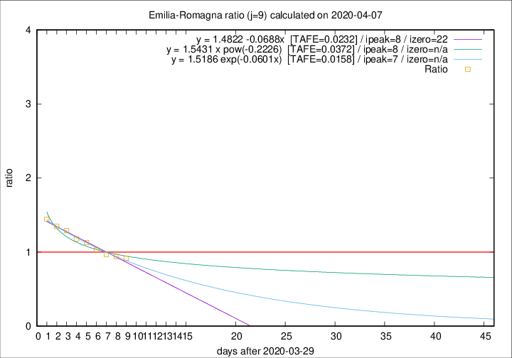

# Emilia-Romagna

Data source: https://raw.githubusercontent.com/pcm-dpc/COVID-19/master/dati-json/dpc-covid19-ita-regioni.json

Estimates in this page were made on 10/4/2020 with data available until 07/04/2020.

## Summary 

### Peak estimate 
|j|linear [TAFE]|exponential [TAFE]|power law [TAFE]|details|
|---|----|-----------|---------|-------|
|7|4/4/2020 [TAFE=0.0311]|4/4/2020 [TAFE=0.0329]|4/4/2020 [TAFE=0.0464]|[analysis](COVID-19_emilia-romagna_j7_2020-04-07.md)|
|8|6/4/2020 [TAFE=0.0286]|6/4/2020 [TAFE=0.0256]|5/4/2020 [TAFE=0.0218]|[analysis](COVID-19_emilia-romagna_j8_2020-04-07.md)|
|9|7/4/2020 [TAFE=0.0232]|6/4/2020 [TAFE=0.0158]|7/4/2020 [TAFE=0.0372]|[analysis](COVID-19_emilia-romagna_j9_2020-04-07.md)|
|10|7/4/2020 [TAFE=0.0423]|7/4/2020 [TAFE=0.0254]|8/4/2020 [TAFE=0.0421]|[analysis](COVID-19_emilia-romagna_j10_2020-04-07.md)|
|11|7/4/2020 [TAFE=0.0815]|8/4/2020 [TAFE=0.0409]|11/4/2020 [TAFE=0.0578]|[analysis](COVID-19_emilia-romagna_j11_2020-04-07.md)|
|12|8/4/2020 [TAFE=0.0925]|9/4/2020 [TAFE=0.0382]|14/4/2020 [TAFE=0.0928]|[analysis](COVID-19_emilia-romagna_j12_2020-04-07.md)|
|13|8/4/2020 [TAFE=0.1028]|9/4/2020 [TAFE=0.0240]|20/4/2020 [TAFE=0.1308]|[analysis](COVID-19_emilia-romagna_j13_2020-04-07.md)|
|14|7/4/2020 [TAFE=0.1933]|10/4/2020 [TAFE=0.0453]|23/4/2020 [TAFE=0.1341]|[analysis](COVID-19_emilia-romagna_j14_2020-04-07.md)|

Best estimator is exp with j=9 (TAFE=0.0158)
Corresponding peak date estimate is 6/4/2020 (ipeak 7)

Peak date range estimate: 2/4/2020 - 28/4/2020

### End estimate 
|j|linear [TAFE/TFE]|exponential [TAFE/TFE]|power law [TAFE/TFE]|details|
|---|----|-----------|---------|-------|
|7|3/5/2020 [TAFE=0.0311]|-|-|[analysis](COVID-19_emilia-romagna_j7_2020-04-07.md)|
|8|27/4/2020 [TAFE=0.0286]|-|-|[analysis](COVID-19_emilia-romagna_j8_2020-04-07.md)|
|9|21/4/2020 [TAFE=0.0232]|-|-|[analysis](COVID-19_emilia-romagna_j9_2020-04-07.md)|
|10|-|-|-|[analysis](COVID-19_emilia-romagna_j10_2020-04-07.md)|
|11|-|-|-|[analysis](COVID-19_emilia-romagna_j11_2020-04-07.md)|
|12|-|-|-|[analysis](COVID-19_emilia-romagna_j12_2020-04-07.md)|
|13|-|-|-|[analysis](COVID-19_emilia-romagna_j13_2020-04-07.md)|
|14|-|-|-|[analysis](COVID-19_emilia-romagna_j14_2020-04-07.md)|

Best estimator is linear with j=9 (TAFE=0.0232)
Corresponding end date estimate is 21/4/2020 (izero 22)

End date range estimate: 30/3/2020 - 1/5/2020

Generated April 10th, 2020 at 17:26:10 UTC+0200 with https://github.com/robianc/COVID-19
