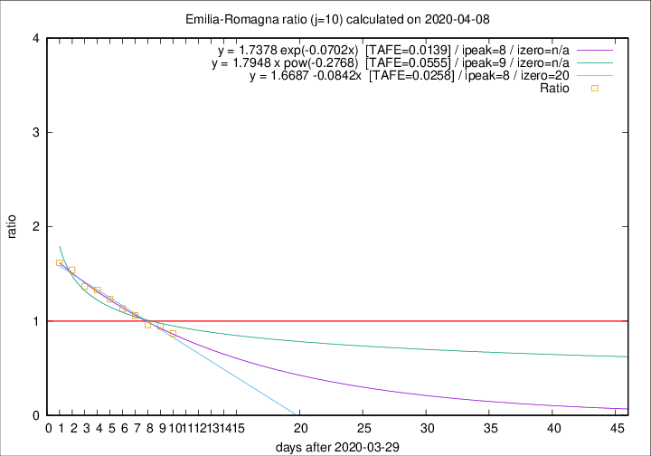

# Emilia-Romagna

Data source: https://raw.githubusercontent.com/pcm-dpc/COVID-19/master/dati-json/dpc-covid19-ita-regioni.json

Delta days analysis (j): 10

Analyses for other values of j for 2020-04-08 are avalable [here](../2020-04-08/README.md)

Analyses for Emilia-Romagna for previous dates are avalable [here](../README.md)

## Fitting 
|fit type|best fit equation|tafe|tfe|ipeak|izero|
|-------|-----|--------|------|---|---|
|linear|y = 1.6687 -0.0842x  [TAFE=0.0258]|0.0258|-0.0002|8|20|
|exp|y = 1.7378 exp(-0.0702x)  [TAFE=0.0139]|0.0139|-0.0000|8|n/a|
|pow|y = 1.7948 x pow(-0.2768)  [TAFE=0.0555]|0.0555|0.0020|9|n/a|

## Data
|Date|Daily deaths|Cumulated deaths|Deaths in the last 10 days|Deaths in the 10 days before|ratio|
|----|----------|-----------|-------|--------------------|-----|
|2020-04-08|54|2234|791|912|0.8673|
|2020-04-07|72|2180|836|886|0.9436|
|2020-04-06|57|2108|841|874|0.9622|
|2020-04-05|74|2051|877|828|1.0592|
|2020-04-04|75|1977|900|793|1.1349|
|2020-04-03|91|1902|917|744|1.2325|
|2020-04-02|79|1811|919|691|1.3300|
|2020-04-01|88|1732|916|670|1.3672|
|2020-03-31|106|1644|929|602|1.5432|
|2020-03-30|95|1538|898|555|1.6180|

[Download data as CSV](COVID-19_emilia-romagna_j10_2020-04-08.csv)

Generated April 19th, 2020 at 18:42:39 UTC+0200 with https://github.com/robianc/COVID-19
