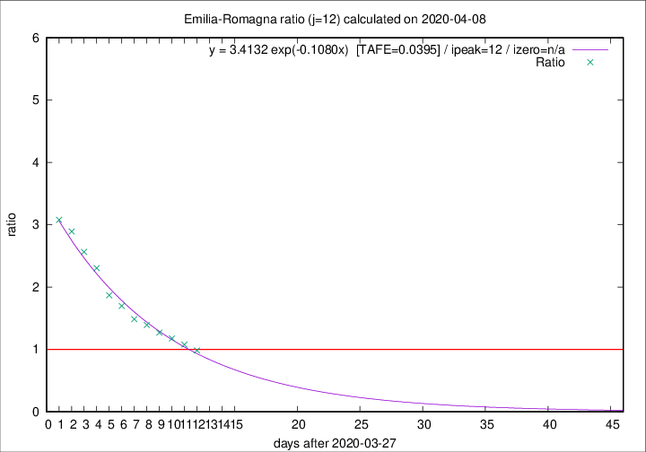

# Emilia-Romagna

Data source: https://raw.githubusercontent.com/pcm-dpc/COVID-19/master/dati-json/dpc-covid19-ita-regioni.json

Delta days analysis (j): 12

Analyses for other values of j for 2020-04-08 are avalable [here](../2020-04-08/README.md)

Analyses for Emilia-Romagna for previous dates are avalable [here](../README.md)

## Fitting 
|fit type|best fit equation|tafe|tfe|ipeak|izero|
|-------|-----|--------|------|---|---|
|exp|y = 3.4132 exp(-0.1080x)  [TAFE=0.0395]|0.0395|0.0009|12|n/a|

## Data
|Date|Daily deaths|Cumulated deaths|Deaths in the last 12 days|Deaths in the 12 days before|ratio|
|----|----------|-----------|-------|--------------------|-----|
|2020-04-08|54|2234|967|983|0.9837|
|2020-04-07|72|2180|1006|933|1.0782|
|2020-04-06|57|2108|1031|876|1.1769|
|2020-04-05|74|2051|1066|839|1.2706|
|2020-04-04|75|1977|1085|779|1.3928|
|2020-04-03|91|1902|1086|731|1.4856|
|2020-04-02|79|1811|1096|645|1.6992|
|2020-04-01|88|1732|1092|584|1.8699|
|2020-03-31|106|1644|1113|483|2.3043|
|2020-03-30|95|1538|1080|421|2.5653|
|2020-03-29|99|1443|1050|363|2.8926|
|2020-03-28|77|1344|998|324|3.0802|

[Download data as CSV](COVID-19_emilia-romagna_j12_2020-04-08.csv)

Generated April 14th, 2020 at 19:16:04 UTC+0200 with https://github.com/robianc/COVID-19
