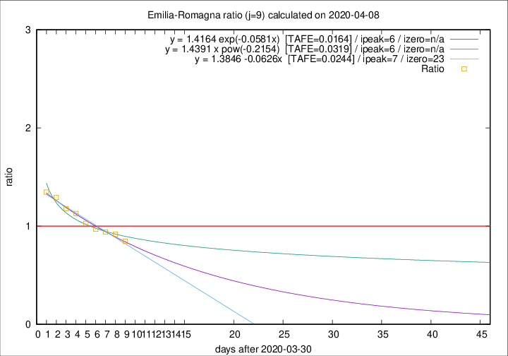

# Emilia-Romagna

Data source: https://raw.githubusercontent.com/pcm-dpc/COVID-19/master/dati-json/dpc-covid19-ita-regioni.json

Estimates in this page were made on 12/4/2020 with data available until 08/04/2020.

## Summary 

### Peak estimate 
|j|linear [TAFE]|exponential [TAFE]|power law [TAFE]|details|
|---|----|-----------|---------|-------|
|7|5/4/2020 [TAFE=0.0321]|5/4/2020 [TAFE=0.0346]|4/4/2020 [TAFE=0.0590]|[analysis](COVID-19_emilia-romagna_j7_2020-04-08.md)|
|8|6/4/2020 [TAFE=0.0296]|5/4/2020 [TAFE=0.0299]|5/4/2020 [TAFE=0.0300]|[analysis](COVID-19_emilia-romagna_j8_2020-04-08.md)|
|9|7/4/2020 [TAFE=0.0244]|6/4/2020 [TAFE=0.0164]|6/4/2020 [TAFE=0.0319]|[analysis](COVID-19_emilia-romagna_j9_2020-04-08.md)|
|10|7/4/2020 [TAFE=0.0258]|7/4/2020 [TAFE=0.0139]|8/4/2020 [TAFE=0.0555]|[analysis](COVID-19_emilia-romagna_j10_2020-04-08.md)|
|11|8/4/2020 [TAFE=0.0745]|8/4/2020 [TAFE=0.0388]|10/4/2020 [TAFE=0.0502]|[analysis](COVID-19_emilia-romagna_j11_2020-04-08.md)|
|12|8/4/2020 [TAFE=0.0934]|9/4/2020 [TAFE=0.0395]|13/4/2020 [TAFE=0.0876]|[analysis](COVID-19_emilia-romagna_j12_2020-04-08.md)|
|13|8/4/2020 [TAFE=0.1077]|10/4/2020 [TAFE=0.0314]|17/4/2020 [TAFE=0.1195]|[analysis](COVID-19_emilia-romagna_j13_2020-04-08.md)|
|14|8/4/2020 [TAFE=0.1560]|10/4/2020 [TAFE=0.0351]|21/4/2020 [TAFE=0.1381]|[analysis](COVID-19_emilia-romagna_j14_2020-04-08.md)|

Best estimator is exp with j=10 (TAFE=0.0139)
Corresponding peak date estimate is 7/4/2020 (ipeak 8)

Peak date range estimate: 1/4/2020 - 25/4/2020

### End estimate 
|j|linear [TAFE/TFE]|exponential [TAFE/TFE]|power law [TAFE/TFE]|details|
|---|----|-----------|---------|-------|
|7|28/4/2020 [TAFE=0.0321]|-|-|[analysis](COVID-19_emilia-romagna_j7_2020-04-08.md)|
|8|27/4/2020 [TAFE=0.0296]|-|-|[analysis](COVID-19_emilia-romagna_j8_2020-04-08.md)|
|9|23/4/2020 [TAFE=0.0244]|-|-|[analysis](COVID-19_emilia-romagna_j9_2020-04-08.md)|
|10|-|-|-|[analysis](COVID-19_emilia-romagna_j10_2020-04-08.md)|
|11|-|-|-|[analysis](COVID-19_emilia-romagna_j11_2020-04-08.md)|
|12|-|-|-|[analysis](COVID-19_emilia-romagna_j12_2020-04-08.md)|
|13|-|-|-|[analysis](COVID-19_emilia-romagna_j13_2020-04-08.md)|
|14|-|-|-|[analysis](COVID-19_emilia-romagna_j14_2020-04-08.md)|

Best estimator is linear with j=9 (TAFE=0.0244)
Corresponding end date estimate is 23/4/2020 (izero 23)

End date range estimate: 31/3/2020 - 26/4/2020

Generated April 12th, 2020 at 17:02:01 UTC+0200 with https://github.com/robianc/COVID-19
