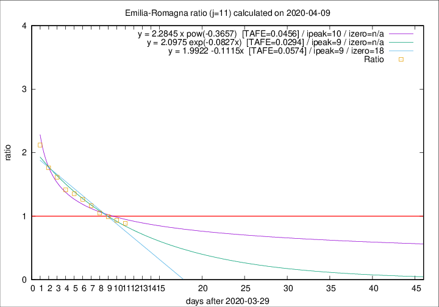

# Emilia-Romagna

Data source: https://raw.githubusercontent.com/pcm-dpc/COVID-19/master/dati-json/dpc-covid19-ita-regioni.json

Delta days analysis (j): 11

Analyses for other values of j for 2020-04-09 are avalable [here](../2020-04-09/README.md)

Analyses for Emilia-Romagna for previous dates are avalable [here](../README.md)

## Fitting 
|fit type|best fit equation|tafe|tfe|ipeak|izero|
|-------|-----|--------|------|---|---|
|linear|y = 1.9922 -0.1115x  [TAFE=0.0574]|0.0574|0.0003|9|18|
|exp|y = 2.0975 exp(-0.0827x)  [TAFE=0.0294]|0.0294|0.0010|9|n/a|
|pow|y = 2.2845 x pow(-0.3657)  [TAFE=0.0456]|0.0456|0.0012|10|n/a|

## Data
|Date|Daily deaths|Cumulated deaths|Deaths in the last 11 days|Deaths in the 11 days before|ratio|
|----|----------|-----------|-------|--------------------|-----|
|2020-04-09|82|2316|873|985|0.8863|
|2020-04-08|54|2234|890|951|0.9359|
|2020-04-07|72|2180|913|921|0.9913|
|2020-04-06|57|2108|934|890|1.0494|
|2020-04-05|74|2051|974|836|1.1651|
|2020-04-04|75|1977|992|784|1.2653|
|2020-04-03|91|1902|1010|746|1.3539|
|2020-04-02|79|1811|995|703|1.4154|
|2020-04-01|88|1732|1017|630|1.6143|
|2020-03-31|106|1644|1004|570|1.7614|
|2020-03-30|95|1538|1007|475|2.1200|

[Download data as CSV](COVID-19_emilia-romagna_j11_2020-04-09.csv)

Generated April 16th, 2020 at 20:09:19 UTC+0200 with https://github.com/robianc/COVID-19
