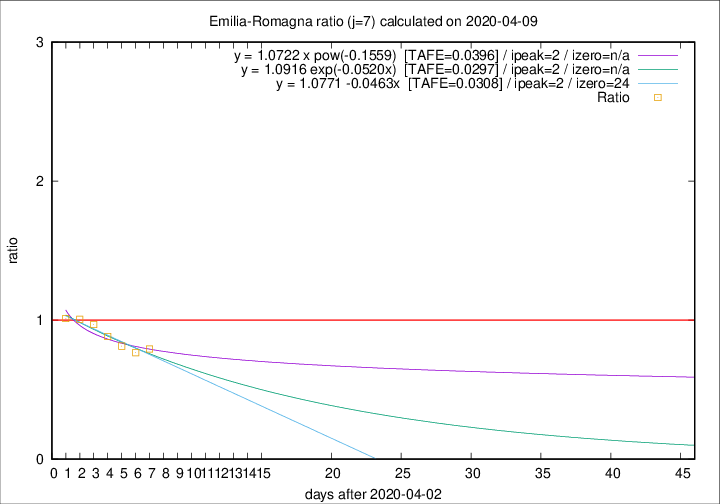

# Emilia-Romagna

Data source: https://raw.githubusercontent.com/pcm-dpc/COVID-19/master/dati-json/dpc-covid19-ita-regioni.json

Delta days analysis (j): 7

Analyses for other values of j for 2020-04-09 are avalable [here](../2020-04-09/README.md)

Analyses for Emilia-Romagna for previous dates are avalable [here](../README.md)

## Fitting 
|fit type|best fit equation|tafe|tfe|ipeak|izero|
|-------|-----|--------|------|---|---|
|linear|y = 1.0771 -0.0463x  [TAFE=0.0308]|0.0308|0.0010|2|24|
|exp|y = 1.0916 exp(-0.0520x)  [TAFE=0.0297]|0.0297|0.0004|2|n/a|
|pow|y = 1.0722 x pow(-0.1559)  [TAFE=0.0396]|0.0396|0.0011|2|n/a|

## Data
|Date|Daily deaths|Cumulated deaths|Deaths in the last 7 days|Deaths in the 7 days before|ratio|
|----|----------|-----------|-------|--------------------|-----|
|2020-04-09|82|2316|505|637|0.7928|
|2020-04-08|54|2234|502|655|0.7664|
|2020-04-07|72|2180|536|659|0.8134|
|2020-04-06|57|2108|570|646|0.8824|
|2020-04-05|74|2051|608|627|0.9697|
|2020-04-04|75|1977|633|629|1.0064|
|2020-04-03|91|1902|635|627|1.0128|

[Download data as CSV](COVID-19_emilia-romagna_j7_2020-04-09.csv)

Generated April 14th, 2020 at 19:16:04 UTC+0200 with https://github.com/robianc/COVID-19
