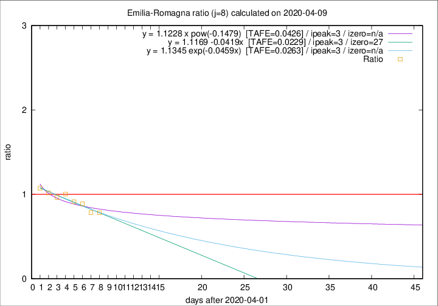

# Emilia-Romagna

Data source: https://raw.githubusercontent.com/pcm-dpc/COVID-19/master/dati-json/dpc-covid19-ita-regioni.json

Estimates in this page were made on 12/4/2020 with data available until 09/04/2020.

## Summary 

### Peak estimate 
|j|linear [TAFE]|exponential [TAFE]|power law [TAFE]|details|
|---|----|-----------|---------|-------|
|7|5/4/2020 [TAFE=0.0308]|5/4/2020 [TAFE=0.0297]|5/4/2020 [TAFE=0.0396]|[analysis](COVID-19_emilia-romagna_j7_2020-04-09.md)|
|8|5/4/2020 [TAFE=0.0229]|5/4/2020 [TAFE=0.0263]|5/4/2020 [TAFE=0.0426]|[analysis](COVID-19_emilia-romagna_j8_2020-04-09.md)|
|9|7/4/2020 [TAFE=0.0229]|7/4/2020 [TAFE=0.0169]|6/4/2020 [TAFE=0.0275]|[analysis](COVID-19_emilia-romagna_j9_2020-04-09.md)|
|10|8/4/2020 [TAFE=0.0291]|8/4/2020 [TAFE=0.0212]|7/4/2020 [TAFE=0.0439]|[analysis](COVID-19_emilia-romagna_j10_2020-04-09.md)|
|11|8/4/2020 [TAFE=0.0574]|8/4/2020 [TAFE=0.0294]|9/4/2020 [TAFE=0.0456]|[analysis](COVID-19_emilia-romagna_j11_2020-04-09.md)|
|12|9/4/2020 [TAFE=0.1036]|9/4/2020 [TAFE=0.0487]|11/4/2020 [TAFE=0.0647]|[analysis](COVID-19_emilia-romagna_j12_2020-04-09.md)|
|13|9/4/2020 [TAFE=0.1120]|10/4/2020 [TAFE=0.0387]|15/4/2020 [TAFE=0.1055]|[analysis](COVID-19_emilia-romagna_j13_2020-04-09.md)|
|14|9/4/2020 [TAFE=0.1295]|11/4/2020 [TAFE=0.0283]|19/4/2020 [TAFE=0.1458]|[analysis](COVID-19_emilia-romagna_j14_2020-04-09.md)|

Best estimator is exp with j=9 (TAFE=0.0169)
Corresponding peak date estimate is 7/4/2020 (ipeak 6)

Peak date range estimate: 3/4/2020 - 24/4/2020

### End estimate 
|j|linear [TAFE/TFE]|exponential [TAFE/TFE]|power law [TAFE/TFE]|details|
|---|----|-----------|---------|-------|
|7|27/4/2020 [TAFE=0.0308]|-|-|[analysis](COVID-19_emilia-romagna_j7_2020-04-09.md)|
|8|29/4/2020 [TAFE=0.0229]|-|-|[analysis](COVID-19_emilia-romagna_j8_2020-04-09.md)|
|9|24/4/2020 [TAFE=0.0229]|-|-|[analysis](COVID-19_emilia-romagna_j9_2020-04-09.md)|
|10|-|-|-|[analysis](COVID-19_emilia-romagna_j10_2020-04-09.md)|
|11|-|-|-|[analysis](COVID-19_emilia-romagna_j11_2020-04-09.md)|
|12|-|-|-|[analysis](COVID-19_emilia-romagna_j12_2020-04-09.md)|
|13|-|-|-|[analysis](COVID-19_emilia-romagna_j13_2020-04-09.md)|
|14|-|-|-|[analysis](COVID-19_emilia-romagna_j14_2020-04-09.md)|

Best estimator is linear with j=8 (TAFE=0.0229)
Corresponding end date estimate is 29/4/2020 (izero 27)

End date range estimate: 2/4/2020 - 29/4/2020

Generated April 12th, 2020 at 16:28:18 UTC+0200 with https://github.com/robianc/COVID-19
