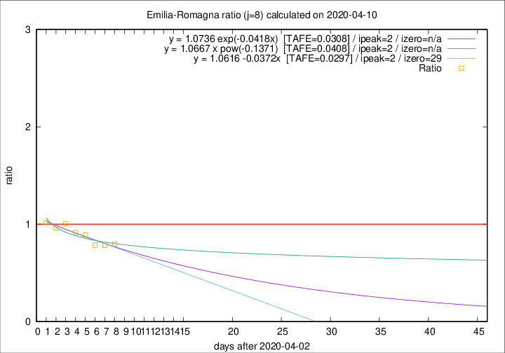

# Emilia-Romagna

Data source: https://raw.githubusercontent.com/pcm-dpc/COVID-19/master/dati-json/dpc-covid19-ita-regioni.json

Delta days analysis (j): 8

Analyses for other values of j for 2020-04-10 are avalable [here](../README.md)

Analyses for Emilia-Romagna for previous dates are avalable [here](../../README.md)

## Fitting 
|fit type|best fit equation|tafe|tfe|ipeak|izero|
|-------|-----|--------|------|---|---|
|linear|y = 1.0616 -0.0372x  [TAFE=0.0297]|0.0297|0.0014|2|29|
|exp|y = 1.0736 exp(-0.0418x)  [TAFE=0.0308]|0.0308|0.0007|2|n/a|
|pow|y = 1.0667 x pow(-0.1371)  [TAFE=0.0408]|0.0408|0.0011|2|n/a|

## Data
|Date|Daily deaths|Cumulated deaths|Deaths in the last 8 days|Deaths in the 8 days before|ratio|
|----|----------|-----------|-------|--------------------|-----|
|2020-04-10|81|2397|586|734|0.7984|
|2020-04-09|82|2316|584|747|0.7818|
|2020-04-08|54|2234|590|752|0.7846|
|2020-04-07|72|2180|642|722|0.8892|
|2020-04-06|57|2108|665|728|0.9135|
|2020-04-05|74|2051|707|704|1.0043|
|2020-04-04|75|1977|710|736|0.9647|
|2020-04-03|91|1902|728|716|1.0168|

[Download data as CSV](COVID-19_emilia-romagna_j8_2020-04-10.csv)

Generated April 10th, 2020 at 17:26:10 UTC+0200 with https://github.com/robianc/COVID-19
