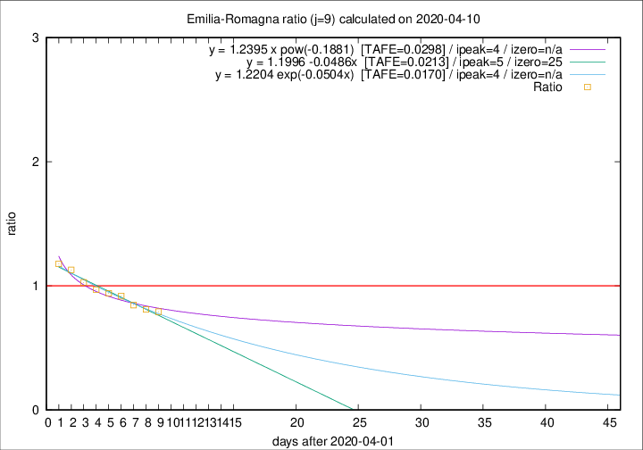

# Emilia-Romagna

Data source: https://raw.githubusercontent.com/pcm-dpc/COVID-19/master/dati-json/dpc-covid19-ita-regioni.json

Delta days analysis (j): 9

Analyses for other values of j for 2020-04-10 are avalable [here](../2020-04-10/README.md)

Analyses for Emilia-Romagna for previous dates are avalable [here](../README.md)

## Fitting 
|fit type|best fit equation|tafe|tfe|ipeak|izero|
|-------|-----|--------|------|---|---|
|linear|y = 1.1996 -0.0486x  [TAFE=0.0213]|0.0213|0.0001|5|25|
|exp|y = 1.2204 exp(-0.0504x)  [TAFE=0.0170]|0.0170|0.0003|4|n/a|
|pow|y = 1.2395 x pow(-0.1881)  [TAFE=0.0298]|0.0298|0.0006|4|n/a|

## Data
|Date|Daily deaths|Cumulated deaths|Deaths in the last 9 days|Deaths in the 9 days before|ratio|
|----|----------|-----------|-------|--------------------|-----|
|2020-04-10|81|2397|665|840|0.7917|
|2020-04-09|82|2316|672|828|0.8116|
|2020-04-08|54|2234|696|823|0.8457|
|2020-04-07|72|2180|737|803|0.9178|
|2020-04-06|57|2108|764|813|0.9397|
|2020-04-05|74|2051|784|809|0.9691|
|2020-04-04|75|1977|803|781|1.0282|
|2020-04-03|91|1902|825|731|1.1286|
|2020-04-02|79|1811|826|701|1.1783|

[Download data as CSV](COVID-19_emilia-romagna_j9_2020-04-10.csv)

Generated April 12th, 2020 at 17:02:01 UTC+0200 with https://github.com/robianc/COVID-19
