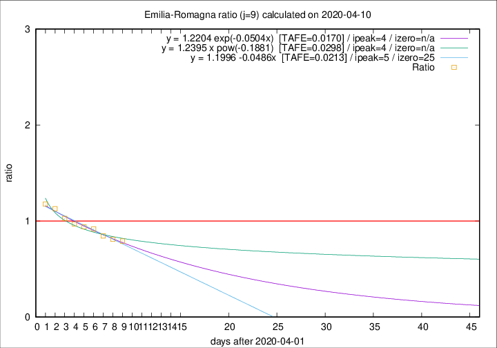

# Emilia-Romagna

Data source: https://raw.githubusercontent.com/pcm-dpc/COVID-19/master/dati-json/dpc-covid19-ita-regioni.json

Estimates in this page were made on 14/4/2020 with data available until 10/04/2020.

## Summary 

### Peak estimate 
|j|linear [TAFE]|exponential [TAFE]|power law [TAFE]|details|
|---|----|-----------|---------|-------|
|7|6/4/2020 [TAFE=0.0391]|6/4/2020 [TAFE=0.0358]|6/4/2020 [TAFE=0.0269]|[analysis](COVID-19_emilia-romagna_j7_2020-04-10.md)|
|8|5/4/2020 [TAFE=0.0297]|5/4/2020 [TAFE=0.0308]|5/4/2020 [TAFE=0.0408]|[analysis](COVID-19_emilia-romagna_j8_2020-04-10.md)|
|9|7/4/2020 [TAFE=0.0213]|6/4/2020 [TAFE=0.0170]|6/4/2020 [TAFE=0.0298]|[analysis](COVID-19_emilia-romagna_j9_2020-04-10.md)|
|10|8/4/2020 [TAFE=0.0316]|8/4/2020 [TAFE=0.0208]|7/4/2020 [TAFE=0.0443]|[analysis](COVID-19_emilia-romagna_j10_2020-04-10.md)|
|11|9/4/2020 [TAFE=0.0434]|9/4/2020 [TAFE=0.0217]|9/4/2020 [TAFE=0.0493]|[analysis](COVID-19_emilia-romagna_j11_2020-04-10.md)|
|12|9/4/2020 [TAFE=0.0983]|10/4/2020 [TAFE=0.0531]|11/4/2020 [TAFE=0.0535]|[analysis](COVID-19_emilia-romagna_j12_2020-04-10.md)|
|13|10/4/2020 [TAFE=0.1206]|10/4/2020 [TAFE=0.0521]|14/4/2020 [TAFE=0.0932]|[analysis](COVID-19_emilia-romagna_j13_2020-04-10.md)|
|14|10/4/2020 [TAFE=0.1328]|11/4/2020 [TAFE=0.0393]|17/4/2020 [TAFE=0.1284]|[analysis](COVID-19_emilia-romagna_j14_2020-04-10.md)|

Best estimator is exp with j=9 (TAFE=0.0170)
Corresponding peak date estimate is 6/4/2020 (ipeak 4)

Peak date range estimate: 4/4/2020 - 22/4/2020

### End estimate 
|j|linear [TAFE/TFE]|exponential [TAFE/TFE]|power law [TAFE/TFE]|details|
|---|----|-----------|---------|-------|
|7|29/4/2020 [TAFE=0.0391]|-|-|[analysis](COVID-19_emilia-romagna_j7_2020-04-10.md)|
|8|2/5/2020 [TAFE=0.0297]|-|-|[analysis](COVID-19_emilia-romagna_j8_2020-04-10.md)|
|9|27/4/2020 [TAFE=0.0213]|-|-|[analysis](COVID-19_emilia-romagna_j9_2020-04-10.md)|
|10|-|-|-|[analysis](COVID-19_emilia-romagna_j10_2020-04-10.md)|
|11|-|-|-|[analysis](COVID-19_emilia-romagna_j11_2020-04-10.md)|
|12|-|-|-|[analysis](COVID-19_emilia-romagna_j12_2020-04-10.md)|
|13|-|-|-|[analysis](COVID-19_emilia-romagna_j13_2020-04-10.md)|
|14|-|-|-|[analysis](COVID-19_emilia-romagna_j14_2020-04-10.md)|

Best estimator is linear with j=9 (TAFE=0.0213)
Corresponding end date estimate is 27/4/2020 (izero 25)

End date range estimate: 2/4/2020 - 1/5/2020

Generated April 14th, 2020 at 19:16:04 UTC+0200 with https://github.com/robianc/COVID-19
