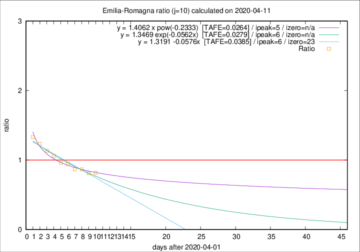

# Emilia-Romagna

Data source: https://raw.githubusercontent.com/pcm-dpc/COVID-19/master/dati-json/dpc-covid19-ita-regioni.json

Delta days analysis (j): 10

Analyses for other values of j for 2020-04-11 are avalable [here](../2020-04-11/README.md)

Analyses for Emilia-Romagna for previous dates are avalable [here](../README.md)

## Fitting 
|fit type|best fit equation|tafe|tfe|ipeak|izero|
|-------|-----|--------|------|---|---|
|linear|y = 1.3191 -0.0576x  [TAFE=0.0385]|0.0385|0.0010|6|23|
|exp|y = 1.3469 exp(-0.0562x)  [TAFE=0.0279]|0.0279|0.0009|6|n/a|
|pow|y = 1.4062 x pow(-0.2333)  [TAFE=0.0264]|0.0264|0.0006|5|n/a|

## Data
|Date|Daily deaths|Cumulated deaths|Deaths in the last 10 days|Deaths in the 10 days before|ratio|
|----|----------|-----------|-------|--------------------|-----|
|2020-04-11|84|2481|749|916|0.8177|
|2020-04-10|81|2397|753|929|0.8105|
|2020-04-09|82|2316|778|898|0.8664|
|2020-04-08|54|2234|791|912|0.8673|
|2020-04-07|72|2180|836|886|0.9436|
|2020-04-06|57|2108|841|874|0.9622|
|2020-04-05|74|2051|877|828|1.0592|
|2020-04-04|75|1977|900|793|1.1349|
|2020-04-03|91|1902|917|744|1.2325|
|2020-04-02|79|1811|919|691|1.3300|

[Download data as CSV](COVID-19_emilia-romagna_j10_2020-04-11.csv)

Generated April 14th, 2020 at 19:16:04 UTC+0200 with https://github.com/robianc/COVID-19
