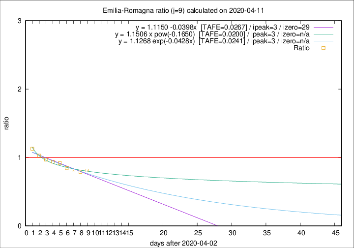

# Emilia-Romagna

Data source: https://raw.githubusercontent.com/pcm-dpc/COVID-19/master/dati-json/dpc-covid19-ita-regioni.json

Estimates in this page were made on 12/4/2020 with data available until 11/04/2020.

## Summary 

### Peak estimate 
|j|linear [TAFE]|exponential [TAFE]|power law [TAFE]|details|
|---|----|-----------|---------|-------|
|7|-|-|-|[analysis](COVID-19_emilia-romagna_j7_2020-04-11.md)|
|8|-|-|6/4/2020 [TAFE=0.0385]|[analysis](COVID-19_emilia-romagna_j8_2020-04-11.md)|
|9|6/4/2020 [TAFE=0.0267]|6/4/2020 [TAFE=0.0241]|6/4/2020 [TAFE=0.0200]|[analysis](COVID-19_emilia-romagna_j9_2020-04-11.md)|
|10|8/4/2020 [TAFE=0.0385]|8/4/2020 [TAFE=0.0279]|7/4/2020 [TAFE=0.0264]|[analysis](COVID-19_emilia-romagna_j10_2020-04-11.md)|
|11|9/4/2020 [TAFE=0.0401]|9/4/2020 [TAFE=0.0256]|8/4/2020 [TAFE=0.0411]|[analysis](COVID-19_emilia-romagna_j11_2020-04-11.md)|
|12|10/4/2020 [TAFE=0.0850]|10/4/2020 [TAFE=0.0460]|10/4/2020 [TAFE=0.0405]|[analysis](COVID-19_emilia-romagna_j12_2020-04-11.md)|
|13|10/4/2020 [TAFE=0.1311]|11/4/2020 [TAFE=0.0643]|13/4/2020 [TAFE=0.0685]|[analysis](COVID-19_emilia-romagna_j13_2020-04-11.md)|
|14|11/4/2020 [TAFE=0.1441]|11/4/2020 [TAFE=0.0551]|16/4/2020 [TAFE=0.1093]|[analysis](COVID-19_emilia-romagna_j14_2020-04-11.md)|

Best estimator is pow with j=9 (TAFE=0.0200)
Corresponding peak date estimate is 6/4/2020 (ipeak 3)

Peak date range estimate: 3/4/2020 - 21/4/2020

### End estimate 
|j|linear [TAFE/TFE]|exponential [TAFE/TFE]|power law [TAFE/TFE]|details|
|---|----|-----------|---------|-------|
|7|11/5/2020 [TAFE=0.0390]|-|-|[analysis](COVID-19_emilia-romagna_j7_2020-04-11.md)|
|8|6/5/2020 [TAFE=0.0350]|-|-|[analysis](COVID-19_emilia-romagna_j8_2020-04-11.md)|
|9|2/5/2020 [TAFE=0.0267]|-|-|[analysis](COVID-19_emilia-romagna_j9_2020-04-11.md)|
|10|-|-|-|[analysis](COVID-19_emilia-romagna_j10_2020-04-11.md)|
|11|-|-|-|[analysis](COVID-19_emilia-romagna_j11_2020-04-11.md)|
|12|-|-|-|[analysis](COVID-19_emilia-romagna_j12_2020-04-11.md)|
|13|-|-|-|[analysis](COVID-19_emilia-romagna_j13_2020-04-11.md)|
|14|-|-|-|[analysis](COVID-19_emilia-romagna_j14_2020-04-11.md)|

Best estimator is linear with j=9 (TAFE=0.0267)
Corresponding end date estimate is 2/5/2020 (izero 29)

End date range estimate: 3/4/2020 - 9/5/2020

Generated April 12th, 2020 at 17:02:01 UTC+0200 with https://github.com/robianc/COVID-19
