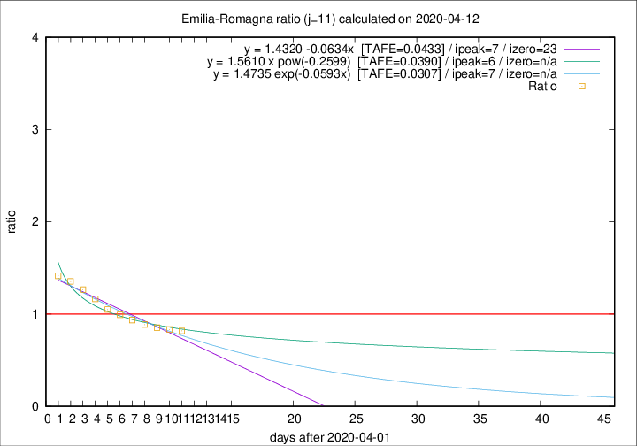

# Emilia-Romagna

Data source: https://raw.githubusercontent.com/pcm-dpc/COVID-19/master/dati-json/dpc-covid19-ita-regioni.json

Delta days analysis (j): 11

Analyses for other values of j for 2020-04-12 are avalable [here](../2020-04-12/README.md)

Analyses for Emilia-Romagna for previous dates are avalable [here](../README.md)

## Fitting 
|fit type|best fit equation|tafe|tfe|ipeak|izero|
|-------|-----|--------|------|---|---|
|linear|y = 1.4320 -0.0634x  [TAFE=0.0433]|0.0433|0.0010|7|23|
|exp|y = 1.4735 exp(-0.0593x)  [TAFE=0.0307]|0.0307|0.0007|7|n/a|
|pow|y = 1.5610 x pow(-0.2599)  [TAFE=0.0390]|0.0390|0.0012|6|n/a|

## Data
|Date|Daily deaths|Cumulated deaths|Deaths in the last 11 days|Deaths in the 11 days before|ratio|
|----|----------|-----------|-------|--------------------|-----|
|2020-04-12|83|2564|832|1017|0.8181|
|2020-04-11|84|2481|837|1004|0.8337|
|2020-04-10|81|2397|859|1007|0.8530|
|2020-04-09|82|2316|873|985|0.8863|
|2020-04-08|54|2234|890|951|0.9359|
|2020-04-07|72|2180|913|921|0.9913|
|2020-04-06|57|2108|934|890|1.0494|
|2020-04-05|74|2051|974|836|1.1651|
|2020-04-04|75|1977|992|784|1.2653|
|2020-04-03|91|1902|1010|746|1.3539|
|2020-04-02|79|1811|995|703|1.4154|

[Download data as CSV](COVID-19_emilia-romagna_j11_2020-04-12.csv)

Generated April 14th, 2020 at 19:16:04 UTC+0200 with https://github.com/robianc/COVID-19
