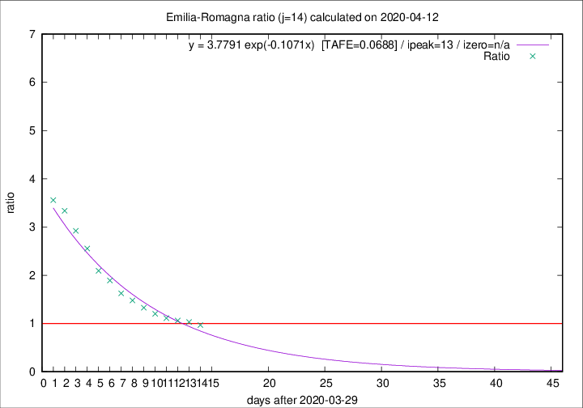

# Emilia-Romagna

Data source: https://raw.githubusercontent.com/pcm-dpc/COVID-19/master/dati-json/dpc-covid19-ita-regioni.json

Delta days analysis (j): 14

Analyses for other values of j for 2020-04-12 are avalable [here](../2020-04-12/README.md)

Analyses for Emilia-Romagna for previous dates are avalable [here](../README.md)

## Fitting 
|fit type|best fit equation|tafe|tfe|ipeak|izero|
|-------|-----|--------|------|---|---|
|exp|y = 3.7791 exp(-0.1071x)  [TAFE=0.0688]|0.0688|0.0030|13|n/a|

## Data
|Date|Daily deaths|Cumulated deaths|Deaths in the last 14 days|Deaths in the 14 days before|ratio|
|----|----------|-----------|-------|--------------------|-----|
|2020-04-12|83|2564|1121|1159|0.9672|
|2020-04-11|84|2481|1137|1103|1.0308|
|2020-04-10|81|2397|1130|1066|1.0600|
|2020-04-09|82|2316|1142|1028|1.1109|
|2020-04-08|54|2234|1157|964|1.2002|
|2020-04-07|72|2180|1195|900|1.3278|
|2020-04-06|57|2108|1216|822|1.4793|
|2020-04-05|74|2051|1235|760|1.6250|
|2020-04-04|75|1977|1262|667|1.8921|
|2020-04-03|91|1902|1262|603|2.0929|
|2020-04-02|79|1811|1280|501|2.5549|
|2020-04-01|88|1732|1274|436|2.9220|
|2020-03-31|106|1644|1251|375|3.3360|
|2020-03-30|95|1538|1192|335|3.5582|

[Download data as CSV](COVID-19_emilia-romagna_j14_2020-04-12.csv)

Generated April 14th, 2020 at 19:16:04 UTC+0200 with https://github.com/robianc/COVID-19
