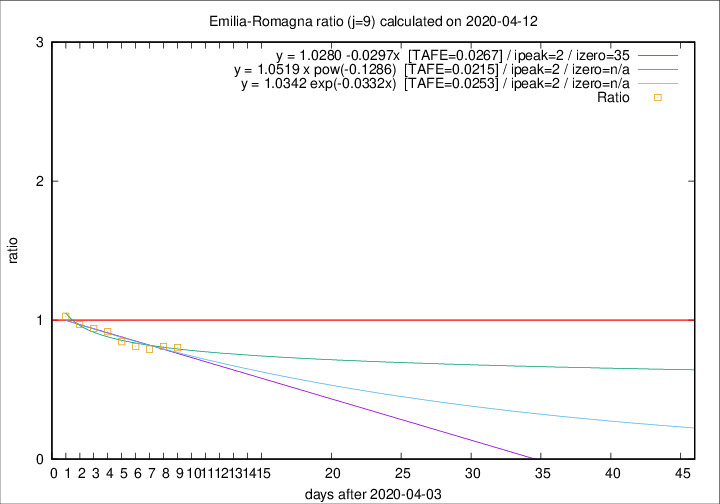

# Emilia-Romagna

Data source: https://raw.githubusercontent.com/pcm-dpc/COVID-19/master/dati-json/dpc-covid19-ita-regioni.json

Delta days analysis (j): 9

Analyses for other values of j for 2020-04-12 are avalable [here](../2020-04-12/README.md)

Analyses for Emilia-Romagna for previous dates are avalable [here](../README.md)

## Fitting 
|fit type|best fit equation|tafe|tfe|ipeak|izero|
|-------|-----|--------|------|---|---|
|linear|y = 1.0280 -0.0297x  [TAFE=0.0267]|0.0267|0.0006|2|35|
|exp|y = 1.0342 exp(-0.0332x)  [TAFE=0.0253]|0.0253|0.0004|2|n/a|
|pow|y = 1.0519 x pow(-0.1286)  [TAFE=0.0215]|0.0215|0.0003|2|n/a|

## Data
|Date|Daily deaths|Cumulated deaths|Deaths in the last 9 days|Deaths in the 9 days before|ratio|
|----|----------|-----------|-------|--------------------|-----|
|2020-04-12|83|2564|662|825|0.8024|
|2020-04-11|84|2481|670|826|0.8111|
|2020-04-10|81|2397|665|840|0.7917|
|2020-04-09|82|2316|672|828|0.8116|
|2020-04-08|54|2234|696|823|0.8457|
|2020-04-07|72|2180|737|803|0.9178|
|2020-04-06|57|2108|764|813|0.9397|
|2020-04-05|74|2051|784|809|0.9691|
|2020-04-04|75|1977|803|781|1.0282|

[Download data as CSV](COVID-19_emilia-romagna_j9_2020-04-12.csv)

Generated April 14th, 2020 at 19:16:04 UTC+0200 with https://github.com/robianc/COVID-19
