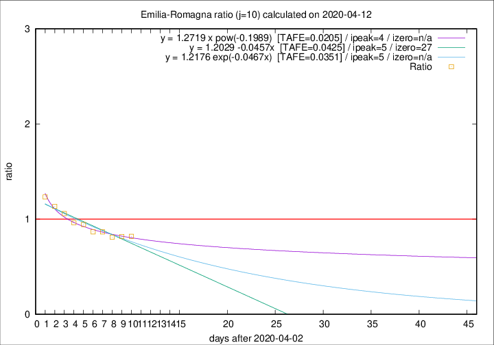

# Emilia-Romagna

Data source: https://raw.githubusercontent.com/pcm-dpc/COVID-19/master/dati-json/dpc-covid19-ita-regioni.json

Estimates in this page were made on 12/4/2020 with data available until 12/04/2020.

## Summary 

### Peak estimate 
|j|linear [TAFE]|exponential [TAFE]|power law [TAFE]|details|
|---|----|-----------|---------|-------|
|7|8/4/2020 [TAFE=0.0366]|8/4/2020 [TAFE=0.0361]|8/4/2020 [TAFE=0.0322]|[analysis](COVID-19_emilia-romagna_j7_2020-04-12.md)|
|8|7/4/2020 [TAFE=0.0433]|7/4/2020 [TAFE=0.0426]|7/4/2020 [TAFE=0.0301]|[analysis](COVID-19_emilia-romagna_j8_2020-04-12.md)|
|9|6/4/2020 [TAFE=0.0267]|6/4/2020 [TAFE=0.0253]|6/4/2020 [TAFE=0.0215]|[analysis](COVID-19_emilia-romagna_j9_2020-04-12.md)|
|10|8/4/2020 [TAFE=0.0425]|8/4/2020 [TAFE=0.0351]|7/4/2020 [TAFE=0.0205]|[analysis](COVID-19_emilia-romagna_j10_2020-04-12.md)|
|11|9/4/2020 [TAFE=0.0433]|9/4/2020 [TAFE=0.0307]|8/4/2020 [TAFE=0.0390]|[analysis](COVID-19_emilia-romagna_j11_2020-04-12.md)|
|12|10/4/2020 [TAFE=0.0621]|10/4/2020 [TAFE=0.0336]|10/4/2020 [TAFE=0.0464]|[analysis](COVID-19_emilia-romagna_j12_2020-04-12.md)|
|13|11/4/2020 [TAFE=0.1254]|11/4/2020 [TAFE=0.0666]|12/4/2020 [TAFE=0.0492]|[analysis](COVID-19_emilia-romagna_j13_2020-04-12.md)|
|14|11/4/2020 [TAFE=0.1507]|12/4/2020 [TAFE=0.0688]|15/4/2020 [TAFE=0.0952]|[analysis](COVID-19_emilia-romagna_j14_2020-04-12.md)|

Best estimator is pow with j=10 (TAFE=0.0205)
Corresponding peak date estimate is 7/4/2020 (ipeak 4)

Peak date range estimate: 5/4/2020 - 19/4/2020

### End estimate 
|j|linear [TAFE/TFE]|exponential [TAFE/TFE]|power law [TAFE/TFE]|details|
|---|----|-----------|---------|-------|
|7|-|-|-|[analysis](COVID-19_emilia-romagna_j7_2020-04-12.md)|
|8|14/5/2020 [TAFE=0.0433]|-|-|[analysis](COVID-19_emilia-romagna_j8_2020-04-12.md)|
|9|9/5/2020 [TAFE=0.0267]|-|-|[analysis](COVID-19_emilia-romagna_j9_2020-04-12.md)|
|10|-|-|-|[analysis](COVID-19_emilia-romagna_j10_2020-04-12.md)|
|11|-|-|-|[analysis](COVID-19_emilia-romagna_j11_2020-04-12.md)|
|12|-|-|-|[analysis](COVID-19_emilia-romagna_j12_2020-04-12.md)|
|13|-|-|-|[analysis](COVID-19_emilia-romagna_j13_2020-04-12.md)|
|14|-|-|-|[analysis](COVID-19_emilia-romagna_j14_2020-04-12.md)|

Best estimator is linear with j=9 (TAFE=0.0267)
Corresponding end date estimate is 9/5/2020 (izero 35)

End date range estimate: 4/4/2020 - 13/5/2020

Generated April 12th, 2020 at 16:28:18 UTC+0200 with https://github.com/robianc/COVID-19
