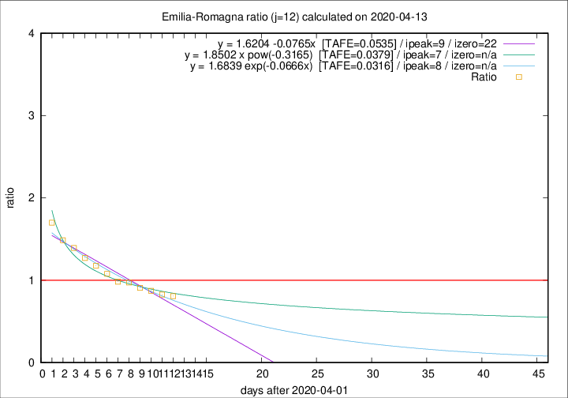

# Emilia-Romagna

Data source: https://raw.githubusercontent.com/pcm-dpc/COVID-19/master/dati-json/dpc-covid19-ita-regioni.json

Delta days analysis (j): 12

Analyses for other values of j for 2020-04-13 are avalable [here](../2020-04-13/README.md)

Analyses for Emilia-Romagna for previous dates are avalable [here](../README.md)

## Fitting 
|fit type|best fit equation|tafe|tfe|ipeak|izero|
|-------|-----|--------|------|---|---|
|linear|y = 1.6204 -0.0765x  [TAFE=0.0535]|0.0535|0.0011|9|22|
|exp|y = 1.6839 exp(-0.0666x)  [TAFE=0.0316]|0.0316|0.0009|8|n/a|
|pow|y = 1.8502 x pow(-0.3165)  [TAFE=0.0379]|0.0379|0.0010|7|n/a|

## Data
|Date|Daily deaths|Cumulated deaths|Deaths in the last 12 days|Deaths in the 12 days before|ratio|
|----|----------|-----------|-------|--------------------|-----|
|2020-04-13|51|2615|883|1092|0.8086|
|2020-04-12|83|2564|920|1113|0.8266|
|2020-04-11|84|2481|943|1080|0.8731|
|2020-04-10|81|2397|954|1050|0.9086|
|2020-04-09|82|2316|972|998|0.9739|
|2020-04-08|54|2234|967|983|0.9837|
|2020-04-07|72|2180|1006|933|1.0782|
|2020-04-06|57|2108|1031|876|1.1769|
|2020-04-05|74|2051|1066|839|1.2706|
|2020-04-04|75|1977|1085|779|1.3928|
|2020-04-03|91|1902|1086|731|1.4856|
|2020-04-02|79|1811|1096|645|1.6992|

[Download data as CSV](COVID-19_emilia-romagna_j12_2020-04-13.csv)

Generated April 16th, 2020 at 20:09:19 UTC+0200 with https://github.com/robianc/COVID-19
