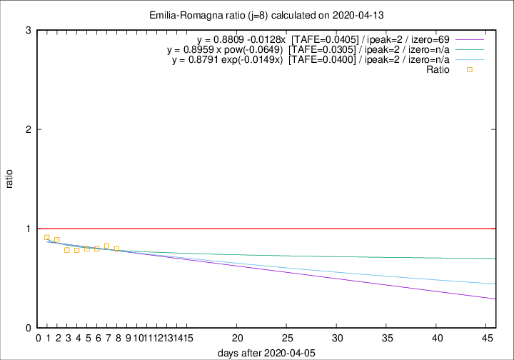

# Emilia-Romagna

Data source: https://raw.githubusercontent.com/pcm-dpc/COVID-19/master/dati-json/dpc-covid19-ita-regioni.json

Delta days analysis (j): 8

Analyses for other values of j for 2020-04-13 are avalable [here](../2020-04-13/README.md)

Analyses for Emilia-Romagna for previous dates are avalable [here](../README.md)

## Fitting 
|fit type|best fit equation|tafe|tfe|ipeak|izero|
|-------|-----|--------|------|---|---|
|linear|y = 0.8809 -0.0128x  [TAFE=0.0405]|0.0405|0.0018|2|69|
|exp|y = 0.8791 exp(-0.0149x)  [TAFE=0.0400]|0.0400|0.0010|2|n/a|
|pow|y = 0.8959 x pow(-0.0649)  [TAFE=0.0305]|0.0305|0.0006|2|n/a|

## Data
|Date|Daily deaths|Cumulated deaths|Deaths in the last 8 days|Deaths in the 8 days before|ratio|
|----|----------|-----------|-------|--------------------|-----|
|2020-04-13|51|2615|564|707|0.7977|
|2020-04-12|83|2564|587|710|0.8268|
|2020-04-11|84|2481|579|728|0.7953|
|2020-04-10|81|2397|586|734|0.7984|
|2020-04-09|82|2316|584|747|0.7818|
|2020-04-08|54|2234|590|752|0.7846|
|2020-04-07|72|2180|642|722|0.8892|
|2020-04-06|57|2108|665|728|0.9135|

[Download data as CSV](COVID-19_emilia-romagna_j8_2020-04-13.csv)

Generated April 16th, 2020 at 20:09:19 UTC+0200 with https://github.com/robianc/COVID-19
