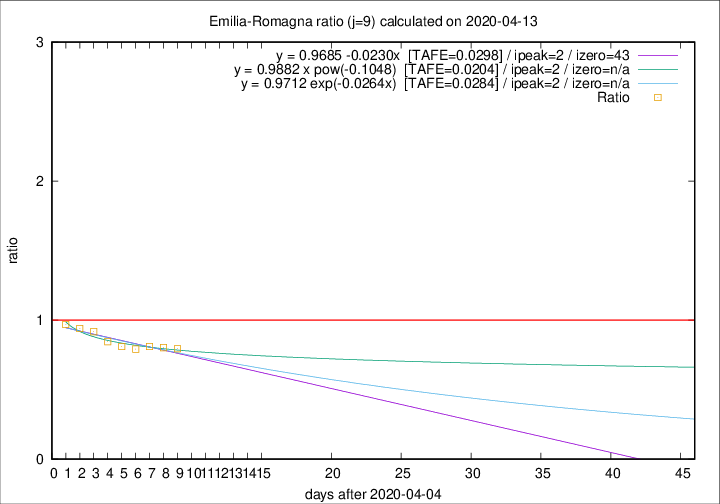

# Emilia-Romagna

Data source: https://raw.githubusercontent.com/pcm-dpc/COVID-19/master/dati-json/dpc-covid19-ita-regioni.json

Estimates in this page were made on 19/4/2020 with data available until 13/04/2020.

## Summary 

### Peak estimate 
|j|linear [TAFE]|exponential [TAFE]|power law [TAFE]|details|
|---|----|-----------|---------|-------|
|7|9/4/2020 [TAFE=0.0295]|9/4/2020 [TAFE=0.0292]|9/4/2020 [TAFE=0.0378]|[analysis](COVID-19_emilia-romagna_j7_2020-04-13.md)|
|8|8/4/2020 [TAFE=0.0405]|8/4/2020 [TAFE=0.0400]|8/4/2020 [TAFE=0.0305]|[analysis](COVID-19_emilia-romagna_j8_2020-04-13.md)|
|9|7/4/2020 [TAFE=0.0298]|7/4/2020 [TAFE=0.0284]|7/4/2020 [TAFE=0.0204]|[analysis](COVID-19_emilia-romagna_j9_2020-04-13.md)|
|10|7/4/2020 [TAFE=0.0376]|7/4/2020 [TAFE=0.0320]|7/4/2020 [TAFE=0.0171]|[analysis](COVID-19_emilia-romagna_j10_2020-04-13.md)|
|11|9/4/2020 [TAFE=0.0493]|9/4/2020 [TAFE=0.0388]|8/4/2020 [TAFE=0.0230]|[analysis](COVID-19_emilia-romagna_j11_2020-04-13.md)|
|12|11/4/2020 [TAFE=0.0535]|10/4/2020 [TAFE=0.0316]|9/4/2020 [TAFE=0.0379]|[analysis](COVID-19_emilia-romagna_j12_2020-04-13.md)|
|13|11/4/2020 [TAFE=0.0995]|11/4/2020 [TAFE=0.0547]|11/4/2020 [TAFE=0.0390]|[analysis](COVID-19_emilia-romagna_j13_2020-04-13.md)|
|14|12/4/2020 [TAFE=0.1558]|12/4/2020 [TAFE=0.0771]|14/4/2020 [TAFE=0.0675]|[analysis](COVID-19_emilia-romagna_j14_2020-04-13.md)|

Best estimator is pow with j=10 (TAFE=0.0171)
Corresponding peak date estimate is 7/4/2020 (ipeak 3)

Peak date range estimate: 6/4/2020 - 18/4/2020

### End estimate 
|j|linear [TAFE/TFE]|exponential [TAFE/TFE]|power law [TAFE/TFE]|details|
|---|----|-----------|---------|-------|
|7|-|-|-|[analysis](COVID-19_emilia-romagna_j7_2020-04-13.md)|
|8|14/6/2020 [TAFE=0.0405]|-|-|[analysis](COVID-19_emilia-romagna_j8_2020-04-13.md)|
|9|18/5/2020 [TAFE=0.0298]|-|-|[analysis](COVID-19_emilia-romagna_j9_2020-04-13.md)|
|10|-|-|-|[analysis](COVID-19_emilia-romagna_j10_2020-04-13.md)|
|11|-|-|-|[analysis](COVID-19_emilia-romagna_j11_2020-04-13.md)|
|12|-|-|-|[analysis](COVID-19_emilia-romagna_j12_2020-04-13.md)|
|13|-|-|-|[analysis](COVID-19_emilia-romagna_j13_2020-04-13.md)|
|14|-|-|-|[analysis](COVID-19_emilia-romagna_j14_2020-04-13.md)|

Best estimator is linear with j=9 (TAFE=0.0298)
Corresponding end date estimate is 18/5/2020 (izero 43)

End date range estimate: 5/4/2020 - 13/6/2020

Generated April 19th, 2020 at 18:42:39 UTC+0200 with https://github.com/robianc/COVID-19
