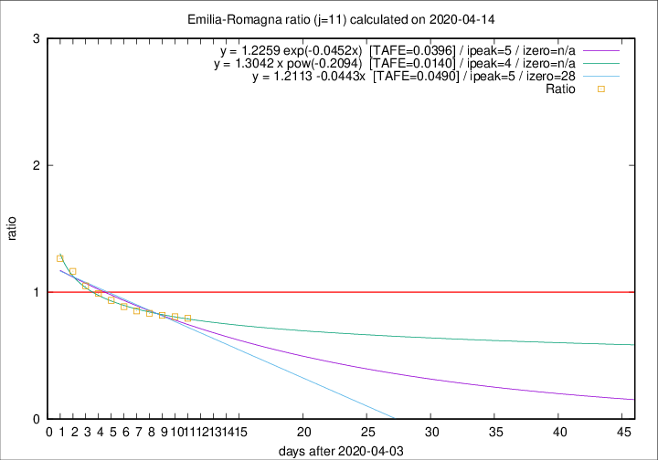

# Emilia-Romagna

Data source: https://raw.githubusercontent.com/pcm-dpc/COVID-19/master/dati-json/dpc-covid19-ita-regioni.json

Estimates in this page were made on 19/4/2020 with data available until 14/04/2020.

## Summary 

### Peak estimate 
|j|linear [TAFE]|exponential [TAFE]|power law [TAFE]|details|
|---|----|-----------|---------|-------|
|7|10/4/2020 [TAFE=0.0329]|10/4/2020 [TAFE=0.0301]|10/4/2020 [TAFE=0.0405]|[analysis](COVID-19_emilia-romagna_j7_2020-04-14.md)|
|8|9/4/2020 [TAFE=0.0432]|9/4/2020 [TAFE=0.0427]|9/4/2020 [TAFE=0.0441]|[analysis](COVID-19_emilia-romagna_j8_2020-04-14.md)|
|9|8/4/2020 [TAFE=0.0344]|8/4/2020 [TAFE=0.0339]|8/4/2020 [TAFE=0.0219]|[analysis](COVID-19_emilia-romagna_j9_2020-04-14.md)|
|10|7/4/2020 [TAFE=0.0314]|7/4/2020 [TAFE=0.0295]|7/4/2020 [TAFE=0.0168]|[analysis](COVID-19_emilia-romagna_j10_2020-04-14.md)|
|11|9/4/2020 [TAFE=0.0490]|9/4/2020 [TAFE=0.0396]|8/4/2020 [TAFE=0.0140]|[analysis](COVID-19_emilia-romagna_j11_2020-04-14.md)|
|12|11/4/2020 [TAFE=0.0503]|10/4/2020 [TAFE=0.0355]|9/4/2020 [TAFE=0.0348]|[analysis](COVID-19_emilia-romagna_j12_2020-04-14.md)|
|13|12/4/2020 [TAFE=0.0769]|12/4/2020 [TAFE=0.0426]|11/4/2020 [TAFE=0.0427]|[analysis](COVID-19_emilia-romagna_j13_2020-04-14.md)|
|14|12/4/2020 [TAFE=0.1401]|13/4/2020 [TAFE=0.0704]|13/4/2020 [TAFE=0.0514]|[analysis](COVID-19_emilia-romagna_j14_2020-04-14.md)|

Best estimator is pow with j=11 (TAFE=0.0140)
Corresponding peak date estimate is 8/4/2020 (ipeak 4)

Peak date range estimate: 6/4/2020 - 16/4/2020

### End estimate 
|j|linear [TAFE/TFE]|exponential [TAFE/TFE]|power law [TAFE/TFE]|details|
|---|----|-----------|---------|-------|
|7|-|-|-|[analysis](COVID-19_emilia-romagna_j7_2020-04-14.md)|
|8|-|-|-|[analysis](COVID-19_emilia-romagna_j8_2020-04-14.md)|
|9|8/6/2020 [TAFE=0.0344]|-|-|[analysis](COVID-19_emilia-romagna_j9_2020-04-14.md)|
|10|14/5/2020 [TAFE=0.0314]|-|-|[analysis](COVID-19_emilia-romagna_j10_2020-04-14.md)|
|11|-|-|-|[analysis](COVID-19_emilia-romagna_j11_2020-04-14.md)|
|12|-|-|-|[analysis](COVID-19_emilia-romagna_j12_2020-04-14.md)|
|13|-|-|-|[analysis](COVID-19_emilia-romagna_j13_2020-04-14.md)|
|14|-|-|-|[analysis](COVID-19_emilia-romagna_j14_2020-04-14.md)|

Best estimator is linear with j=10 (TAFE=0.0314)
Corresponding end date estimate is 14/5/2020 (izero 39)

End date range estimate: 5/4/2020 - 7/6/2020

Generated April 19th, 2020 at 18:42:39 UTC+0200 with https://github.com/robianc/COVID-19
