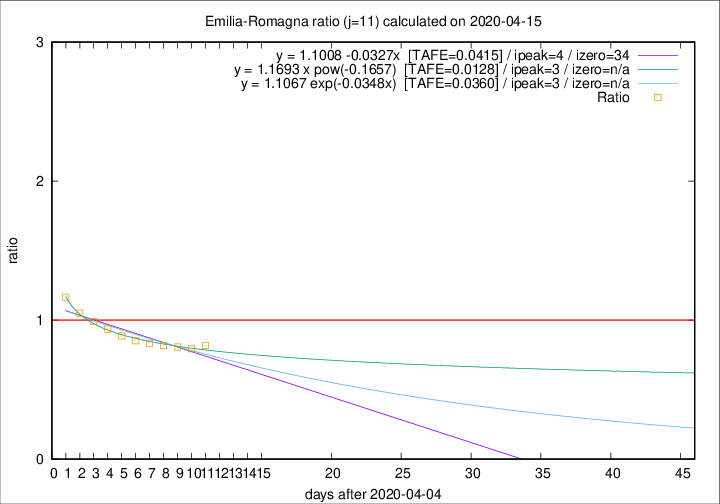

# Emilia-Romagna

Data source: https://raw.githubusercontent.com/pcm-dpc/COVID-19/master/dati-json/dpc-covid19-ita-regioni.json

Delta days analysis (j): 11

Analyses for other values of j for 2020-04-15 are avalable [here](../2020-04-15/README.md)

Analyses for Emilia-Romagna for previous dates are avalable [here](../README.md)

## Fitting 
|fit type|best fit equation|tafe|tfe|ipeak|izero|
|-------|-----|--------|------|---|---|
|linear|y = 1.1008 -0.0327x  [TAFE=0.0415]|0.0415|0.0017|4|34|
|exp|y = 1.1067 exp(-0.0348x)  [TAFE=0.0360]|0.0360|0.0009|3|n/a|
|pow|y = 1.1693 x pow(-0.1657)  [TAFE=0.0128]|0.0128|0.0002|3|n/a|

## Data
|Date|Daily deaths|Cumulated deaths|Deaths in the last 11 days|Deaths in the 11 days before|ratio|
|----|----------|-----------|-------|--------------------|-----|
|2020-04-15|83|2788|811|992|0.8175|
|2020-04-14|90|2705|803|1010|0.7950|
|2020-04-13|51|2615|804|995|0.8080|
|2020-04-12|83|2564|832|1017|0.8181|
|2020-04-11|84|2481|837|1004|0.8337|
|2020-04-10|81|2397|859|1007|0.8530|
|2020-04-09|82|2316|873|985|0.8863|
|2020-04-08|54|2234|890|951|0.9359|
|2020-04-07|72|2180|913|921|0.9913|
|2020-04-06|57|2108|934|890|1.0494|
|2020-04-05|74|2051|974|836|1.1651|

[Download data as CSV](COVID-19_emilia-romagna_j11_2020-04-15.csv)

Generated April 16th, 2020 at 20:09:19 UTC+0200 with https://github.com/robianc/COVID-19
