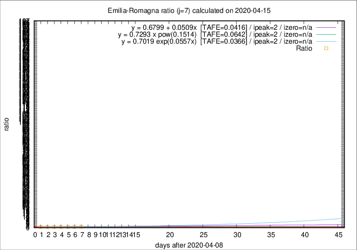

# Emilia-Romagna

Data source: https://raw.githubusercontent.com/pcm-dpc/COVID-19/master/dati-json/dpc-covid19-ita-regioni.json

Delta days analysis (j): 7

Analyses for other values of j for 2020-04-15 are avalable [here](../2020-04-15/README.md)

Analyses for Emilia-Romagna for previous dates are avalable [here](../README.md)

## Fitting 
|fit type|best fit equation|tafe|tfe|ipeak|izero|
|-------|-----|--------|------|---|---|
|linear|y = 0.6799 + 0.0509x  [TAFE=0.0416]|0.0416|0.0018|2|n/a|
|exp|y = 0.7019 exp(0.0557x)  [TAFE=0.0366]|0.0366|0.0010|2|n/a|
|pow|y = 0.7293 x pow(0.1514)  [TAFE=0.0642]|0.0642|0.0024|2|n/a|

## Data
|Date|Daily deaths|Cumulated deaths|Deaths in the last 7 days|Deaths in the 7 days before|ratio|
|----|----------|-----------|-------|--------------------|-----|
|2020-04-15|83|2788|554|502|1.1036|
|2020-04-14|90|2705|525|536|0.9795|
|2020-04-13|51|2615|507|570|0.8895|
|2020-04-12|83|2564|513|608|0.8438|
|2020-04-11|84|2481|504|633|0.7962|
|2020-04-10|81|2397|495|635|0.7795|
|2020-04-09|82|2316|505|637|0.7928|

[Download data as CSV](COVID-19_emilia-romagna_j7_2020-04-15.csv)

Generated April 19th, 2020 at 18:42:39 UTC+0200 with https://github.com/robianc/COVID-19
