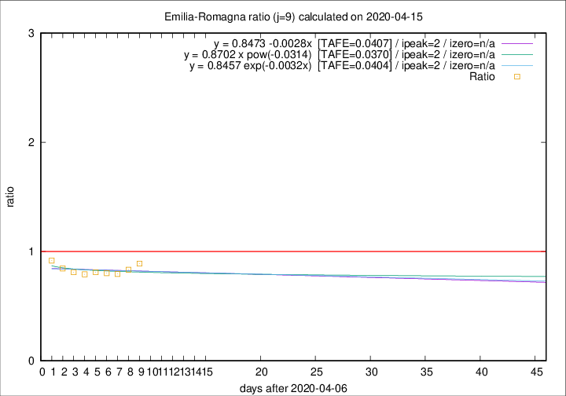

# Emilia-Romagna

Data source: https://raw.githubusercontent.com/pcm-dpc/COVID-19/master/dati-json/dpc-covid19-ita-regioni.json

Delta days analysis (j): 9

Analyses for other values of j for 2020-04-15 are avalable [here](../2020-04-15/README.md)

Analyses for Emilia-Romagna for previous dates are avalable [here](../README.md)

## Fitting 
|fit type|best fit equation|tafe|tfe|ipeak|izero|
|-------|-----|--------|------|---|---|
|linear|y = 0.8473 -0.0028x  [TAFE=0.0407]|0.0407|0.0024|2|n/a|
|exp|y = 0.8457 exp(-0.0032x)  [TAFE=0.0404]|0.0404|0.0012|2|n/a|
|pow|y = 0.8702 x pow(-0.0314)  [TAFE=0.0370]|0.0370|0.0009|2|n/a|

## Data
|Date|Daily deaths|Cumulated deaths|Deaths in the last 9 days|Deaths in the 9 days before|ratio|
|----|----------|-----------|-------|--------------------|-----|
|2020-04-15|83|2788|680|764|0.8901|
|2020-04-14|90|2705|654|784|0.8342|
|2020-04-13|51|2615|638|803|0.7945|
|2020-04-12|83|2564|662|825|0.8024|
|2020-04-11|84|2481|670|826|0.8111|
|2020-04-10|81|2397|665|840|0.7917|
|2020-04-09|82|2316|672|828|0.8116|
|2020-04-08|54|2234|696|823|0.8457|
|2020-04-07|72|2180|737|803|0.9178|

[Download data as CSV](COVID-19_emilia-romagna_j9_2020-04-15.csv)

Generated April 16th, 2020 at 20:09:19 UTC+0200 with https://github.com/robianc/COVID-19
