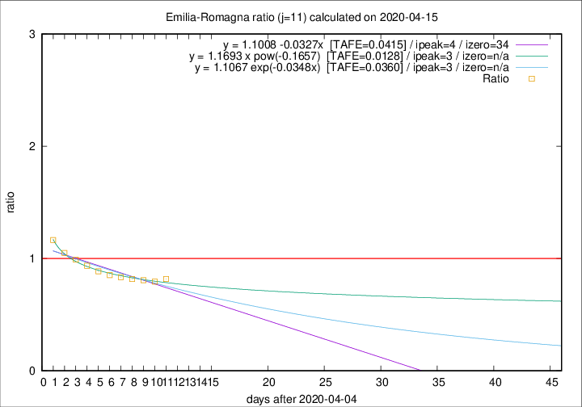

# Emilia-Romagna

Data source: https://raw.githubusercontent.com/pcm-dpc/COVID-19/master/dati-json/dpc-covid19-ita-regioni.json

Estimates in this page were made on 16/4/2020 with data available until 15/04/2020.

## Summary 

### Peak estimate 
|j|linear [TAFE]|exponential [TAFE]|power law [TAFE]|details|
|---|----|-----------|---------|-------|
|7|11/4/2020 [TAFE=0.0416]|11/4/2020 [TAFE=0.0366]|11/4/2020 [TAFE=0.0642]|[analysis](COVID-19_emilia-romagna_j7_2020-04-15.md)|
|8|10/4/2020 [TAFE=0.0291]|10/4/2020 [TAFE=0.0280]|10/4/2020 [TAFE=0.0404]|[analysis](COVID-19_emilia-romagna_j8_2020-04-15.md)|
|9|9/4/2020 [TAFE=0.0407]|9/4/2020 [TAFE=0.0404]|9/4/2020 [TAFE=0.0370]|[analysis](COVID-19_emilia-romagna_j9_2020-04-15.md)|
|10|8/4/2020 [TAFE=0.0351]|8/4/2020 [TAFE=0.0338]|8/4/2020 [TAFE=0.0221]|[analysis](COVID-19_emilia-romagna_j10_2020-04-15.md)|
|11|9/4/2020 [TAFE=0.0415]|8/4/2020 [TAFE=0.0360]|8/4/2020 [TAFE=0.0128]|[analysis](COVID-19_emilia-romagna_j11_2020-04-15.md)|
|12|11/4/2020 [TAFE=0.0551]|11/4/2020 [TAFE=0.0443]|9/4/2020 [TAFE=0.0249]|[analysis](COVID-19_emilia-romagna_j12_2020-04-15.md)|
|13|12/4/2020 [TAFE=0.0671]|12/4/2020 [TAFE=0.0452]|11/4/2020 [TAFE=0.0320]|[analysis](COVID-19_emilia-romagna_j13_2020-04-15.md)|
|14|13/4/2020 [TAFE=0.1141]|13/4/2020 [TAFE=0.0615]|13/4/2020 [TAFE=0.0390]|[analysis](COVID-19_emilia-romagna_j14_2020-04-15.md)|

Best estimator is pow with j=11 (TAFE=0.0128)
Corresponding peak date estimate is 8/4/2020 (ipeak 3)

Peak date range estimate: 7/4/2020 - 16/4/2020

### End estimate 
|j|linear [TAFE/TFE]|exponential [TAFE/TFE]|power law [TAFE/TFE]|details|
|---|----|-----------|---------|-------|
|7|-|-|-|[analysis](COVID-19_emilia-romagna_j7_2020-04-15.md)|
|8|-|-|-|[analysis](COVID-19_emilia-romagna_j8_2020-04-15.md)|
|9|-|-|-|[analysis](COVID-19_emilia-romagna_j9_2020-04-15.md)|
|10|5/6/2020 [TAFE=0.0351]|-|-|[analysis](COVID-19_emilia-romagna_j10_2020-04-15.md)|
|11|-|-|-|[analysis](COVID-19_emilia-romagna_j11_2020-04-15.md)|
|12|-|-|-|[analysis](COVID-19_emilia-romagna_j12_2020-04-15.md)|
|13|-|-|-|[analysis](COVID-19_emilia-romagna_j13_2020-04-15.md)|
|14|-|-|-|[analysis](COVID-19_emilia-romagna_j14_2020-04-15.md)|

Best estimator is linear with j=10 (TAFE=0.0351)
Corresponding end date estimate is 5/6/2020 (izero 60)

End date range estimate: 6/4/2020 - 5/6/2020

Generated April 16th, 2020 at 20:09:19 UTC+0200 with https://github.com/robianc/COVID-19
