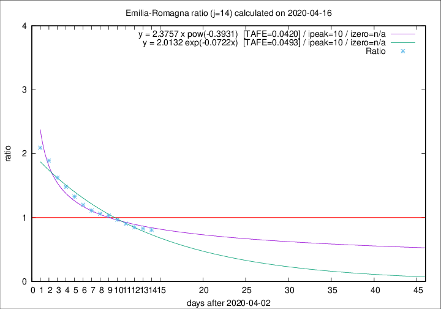

# Emilia-Romagna

Data source: https://raw.githubusercontent.com/pcm-dpc/COVID-19/master/dati-json/dpc-covid19-ita-regioni.json

Delta days analysis (j): 14

Analyses for other values of j for 2020-04-16 are avalable [here](../2020-04-16/README.md)

Analyses for Emilia-Romagna for previous dates are avalable [here](../README.md)

## Fitting 
|fit type|best fit equation|tafe|tfe|ipeak|izero|
|-------|-----|--------|------|---|---|
|exp|y = 2.0132 exp(-0.0722x)  [TAFE=0.0493]|0.0493|0.0022|10|n/a|
|pow|y = 2.3757 x pow(-0.3931)  [TAFE=0.0420]|0.0420|0.0014|10|n/a|

## Data
|Date|Daily deaths|Cumulated deaths|Deaths in the last 14 days|Deaths in the 14 days before|ratio|
|----|----------|-----------|-------|--------------------|-----|
|2020-04-16|55|2843|1032|1280|0.8063|
|2020-04-15|83|2788|1056|1274|0.8289|
|2020-04-14|90|2705|1061|1251|0.8481|
|2020-04-13|51|2615|1077|1192|0.9035|
|2020-04-12|83|2564|1121|1159|0.9672|
|2020-04-11|84|2481|1137|1103|1.0308|
|2020-04-10|81|2397|1130|1066|1.0600|
|2020-04-09|82|2316|1142|1028|1.1109|
|2020-04-08|54|2234|1157|964|1.2002|
|2020-04-07|72|2180|1195|900|1.3278|
|2020-04-06|57|2108|1216|822|1.4793|
|2020-04-05|74|2051|1235|760|1.6250|
|2020-04-04|75|1977|1262|667|1.8921|
|2020-04-03|91|1902|1262|603|2.0929|

[Download data as CSV](COVID-19_emilia-romagna_j14_2020-04-16.csv)

Generated April 16th, 2020 at 20:09:19 UTC+0200 with https://github.com/robianc/COVID-19
