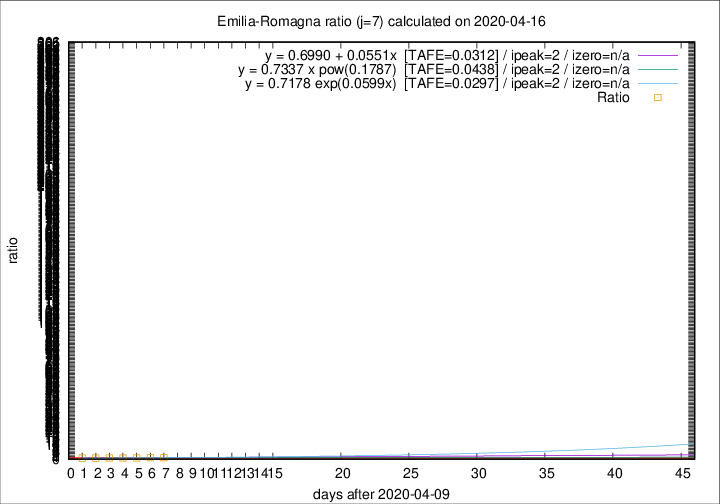

# Emilia-Romagna

Data source: https://raw.githubusercontent.com/pcm-dpc/COVID-19/master/dati-json/dpc-covid19-ita-regioni.json

Delta days analysis (j): 7

Analyses for other values of j for 2020-04-16 are avalable [here](../2020-04-16/README.md)

Analyses for Emilia-Romagna for previous dates are avalable [here](../README.md)

## Fitting 
|fit type|best fit equation|tafe|tfe|ipeak|izero|
|-------|-----|--------|------|---|---|
|linear|y = 0.6990 + 0.0551x  [TAFE=0.0312]|0.0312|0.0013|2|n/a|
|exp|y = 0.7178 exp(0.0599x)  [TAFE=0.0297]|0.0297|0.0006|2|n/a|
|pow|y = 0.7337 x pow(0.1787)  [TAFE=0.0438]|0.0438|0.0013|2|n/a|

## Data
|Date|Daily deaths|Cumulated deaths|Deaths in the last 7 days|Deaths in the 7 days before|ratio|
|----|----------|-----------|-------|--------------------|-----|
|2020-04-16|55|2843|527|505|1.0436|
|2020-04-15|83|2788|554|502|1.1036|
|2020-04-14|90|2705|525|536|0.9795|
|2020-04-13|51|2615|507|570|0.8895|
|2020-04-12|83|2564|513|608|0.8438|
|2020-04-11|84|2481|504|633|0.7962|
|2020-04-10|81|2397|495|635|0.7795|

[Download data as CSV](COVID-19_emilia-romagna_j7_2020-04-16.csv)

Generated April 16th, 2020 at 20:09:19 UTC+0200 with https://github.com/robianc/COVID-19
