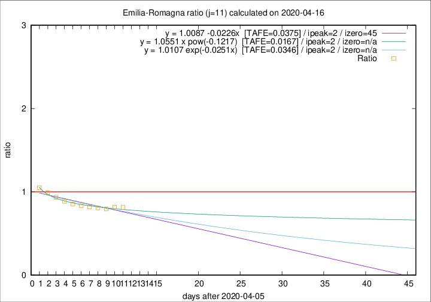

# Emilia-Romagna

Data source: https://raw.githubusercontent.com/pcm-dpc/COVID-19/master/dati-json/dpc-covid19-ita-regioni.json

Estimates in this page were made on 19/4/2020 with data available until 16/04/2020.

## Summary 

### Peak estimate 
|j|linear [TAFE]|exponential [TAFE]|power law [TAFE]|details|
|---|----|-----------|---------|-------|
|7|12/4/2020 [TAFE=0.0312]|12/4/2020 [TAFE=0.0297]|12/4/2020 [TAFE=0.0438]|[analysis](COVID-19_emilia-romagna_j7_2020-04-16.md)|
|8|11/4/2020 [TAFE=0.0356]|11/4/2020 [TAFE=0.0326]|11/4/2020 [TAFE=0.0486]|[analysis](COVID-19_emilia-romagna_j8_2020-04-16.md)|
|9|10/4/2020 [TAFE=0.0326]|10/4/2020 [TAFE=0.0321]|10/4/2020 [TAFE=0.0371]|[analysis](COVID-19_emilia-romagna_j9_2020-04-16.md)|
|10|9/4/2020 [TAFE=0.0381]|9/4/2020 [TAFE=0.0379]|9/4/2020 [TAFE=0.0315]|[analysis](COVID-19_emilia-romagna_j10_2020-04-16.md)|
|11|8/4/2020 [TAFE=0.0375]|8/4/2020 [TAFE=0.0346]|8/4/2020 [TAFE=0.0167]|[analysis](COVID-19_emilia-romagna_j11_2020-04-16.md)|
|12|11/4/2020 [TAFE=0.0531]|10/4/2020 [TAFE=0.0435]|9/4/2020 [TAFE=0.0201]|[analysis](COVID-19_emilia-romagna_j12_2020-04-16.md)|
|13|12/4/2020 [TAFE=0.0617]|12/4/2020 [TAFE=0.0443]|11/4/2020 [TAFE=0.0331]|[analysis](COVID-19_emilia-romagna_j13_2020-04-16.md)|
|14|13/4/2020 [TAFE=0.0886]|13/4/2020 [TAFE=0.0493]|13/4/2020 [TAFE=0.0420]|[analysis](COVID-19_emilia-romagna_j14_2020-04-16.md)|

Best estimator is pow with j=11 (TAFE=0.0167)
Corresponding peak date estimate is 8/4/2020 (ipeak 2)

Peak date range estimate: 8/4/2020 - 16/4/2020

### End estimate 
|j|linear [TAFE/TFE]|exponential [TAFE/TFE]|power law [TAFE/TFE]|details|
|---|----|-----------|---------|-------|
|7|-|-|-|[analysis](COVID-19_emilia-romagna_j7_2020-04-16.md)|
|8|-|-|-|[analysis](COVID-19_emilia-romagna_j8_2020-04-16.md)|
|9|-|-|-|[analysis](COVID-19_emilia-romagna_j9_2020-04-16.md)|
|10|-|-|-|[analysis](COVID-19_emilia-romagna_j10_2020-04-16.md)|
|11|21/5/2020 [TAFE=0.0375]|-|-|[analysis](COVID-19_emilia-romagna_j11_2020-04-16.md)|
|12|-|-|-|[analysis](COVID-19_emilia-romagna_j12_2020-04-16.md)|
|13|-|-|-|[analysis](COVID-19_emilia-romagna_j13_2020-04-16.md)|
|14|-|-|-|[analysis](COVID-19_emilia-romagna_j14_2020-04-16.md)|

Best estimator is linear with j=11 (TAFE=0.0375)
Corresponding end date estimate is 21/5/2020 (izero 45)

End date range estimate: 6/4/2020 - 21/5/2020

Generated April 19th, 2020 at 18:42:39 UTC+0200 with https://github.com/robianc/COVID-19
