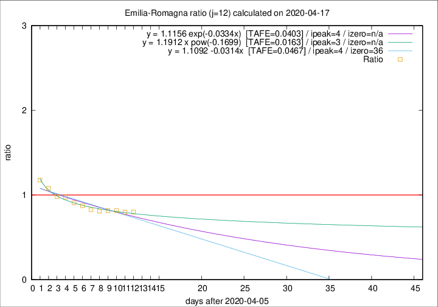

# Emilia-Romagna

Data source: https://raw.githubusercontent.com/pcm-dpc/COVID-19/master/dati-json/dpc-covid19-ita-regioni.json

Delta days analysis (j): 12

Analyses for other values of j for 2020-04-17 are avalable [here](../2020-04-17/README.md)

Analyses for Emilia-Romagna for previous dates are avalable [here](../README.md)

## Fitting 
|fit type|best fit equation|tafe|tfe|ipeak|izero|
|-------|-----|--------|------|---|---|
|linear|y = 1.1092 -0.0314x  [TAFE=0.0467]|0.0467|0.0024|4|36|
|exp|y = 1.1156 exp(-0.0334x)  [TAFE=0.0403]|0.0403|0.0014|4|n/a|
|pow|y = 1.1912 x pow(-0.1699)  [TAFE=0.0163]|0.0163|0.0002|3|n/a|

## Data
|Date|Daily deaths|Cumulated deaths|Deaths in the last 12 days|Deaths in the 12 days before|ratio|
|----|----------|-----------|-------|--------------------|-----|
|2020-04-17|60|2903|852|1066|0.7992|
|2020-04-16|55|2843|866|1085|0.7982|
|2020-04-15|83|2788|886|1086|0.8158|
|2020-04-14|90|2705|894|1096|0.8157|
|2020-04-13|51|2615|883|1092|0.8086|
|2020-04-12|83|2564|920|1113|0.8266|
|2020-04-11|84|2481|943|1080|0.8731|
|2020-04-10|81|2397|954|1050|0.9086|
|2020-04-09|82|2316|972|998|0.9739|
|2020-04-08|54|2234|967|983|0.9837|
|2020-04-07|72|2180|1006|933|1.0782|
|2020-04-06|57|2108|1031|876|1.1769|

[Download data as CSV](COVID-19_emilia-romagna_j12_2020-04-17.csv)

Generated April 19th, 2020 at 18:42:39 UTC+0200 with https://github.com/robianc/COVID-19
