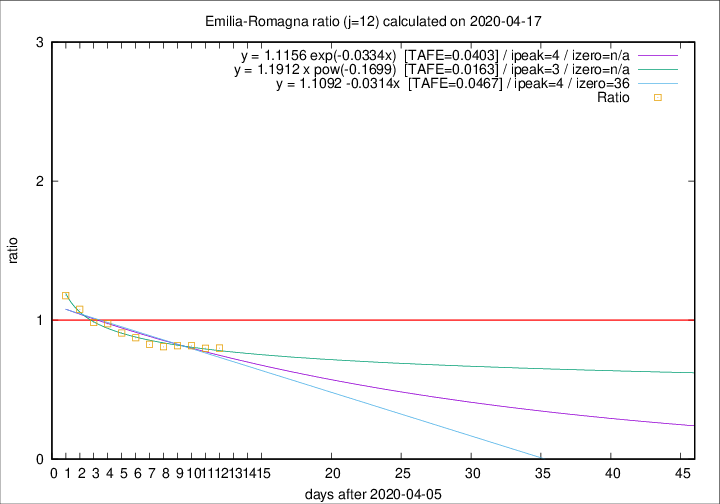
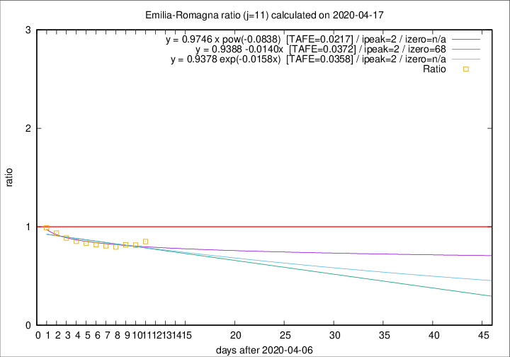

# Emilia-Romagna

Data source: https://raw.githubusercontent.com/pcm-dpc/COVID-19/master/dati-json/dpc-covid19-ita-regioni.json

Estimates in this page were made on 19/4/2020 with data available until 17/04/2020.

## Summary 

### Peak estimate 
|j|linear [TAFE]|exponential [TAFE]|power law [TAFE]|details|
|---|----|-----------|---------|-------|
|7|13/4/2020 [TAFE=0.0367]|13/4/2020 [TAFE=0.0382]|13/4/2020 [TAFE=0.0338]|[analysis](COVID-19_emilia-romagna_j7_2020-04-17.md)|
|8|12/4/2020 [TAFE=0.0277]|12/4/2020 [TAFE=0.0264]|12/4/2020 [TAFE=0.0476]|[analysis](COVID-19_emilia-romagna_j8_2020-04-17.md)|
|9|11/4/2020 [TAFE=0.0268]|11/4/2020 [TAFE=0.0259]|11/4/2020 [TAFE=0.0401]|[analysis](COVID-19_emilia-romagna_j9_2020-04-17.md)|
|10|10/4/2020 [TAFE=0.0331]|10/4/2020 [TAFE=0.0331]|10/4/2020 [TAFE=0.0330]|[analysis](COVID-19_emilia-romagna_j10_2020-04-17.md)|
|11|9/4/2020 [TAFE=0.0372]|9/4/2020 [TAFE=0.0358]|9/4/2020 [TAFE=0.0217]|[analysis](COVID-19_emilia-romagna_j11_2020-04-17.md)|
|12|10/4/2020 [TAFE=0.0467]|10/4/2020 [TAFE=0.0403]|9/4/2020 [TAFE=0.0163]|[analysis](COVID-19_emilia-romagna_j12_2020-04-17.md)|
|13|12/4/2020 [TAFE=0.0603]|12/4/2020 [TAFE=0.0455]|11/4/2020 [TAFE=0.0260]|[analysis](COVID-19_emilia-romagna_j13_2020-04-17.md)|
|14|14/4/2020 [TAFE=0.0790]|13/4/2020 [TAFE=0.0494]|12/4/2020 [TAFE=0.0335]|[analysis](COVID-19_emilia-romagna_j14_2020-04-17.md)|

Best estimator is pow with j=12 (TAFE=0.0163)
Corresponding peak date estimate is 9/4/2020 (ipeak 3)

Peak date range estimate: 8/4/2020 - 16/4/2020

### End estimate 
|j|linear [TAFE/TFE]|exponential [TAFE/TFE]|power law [TAFE/TFE]|details|
|---|----|-----------|---------|-------|
|7|-|-|-|[analysis](COVID-19_emilia-romagna_j7_2020-04-17.md)|
|8|-|-|-|[analysis](COVID-19_emilia-romagna_j8_2020-04-17.md)|
|9|-|-|-|[analysis](COVID-19_emilia-romagna_j9_2020-04-17.md)|
|10|-|-|-|[analysis](COVID-19_emilia-romagna_j10_2020-04-17.md)|
|11|14/6/2020 [TAFE=0.0372]|-|-|[analysis](COVID-19_emilia-romagna_j11_2020-04-17.md)|
|12|-|-|-|[analysis](COVID-19_emilia-romagna_j12_2020-04-17.md)|
|13|-|-|-|[analysis](COVID-19_emilia-romagna_j13_2020-04-17.md)|
|14|-|-|-|[analysis](COVID-19_emilia-romagna_j14_2020-04-17.md)|

Best estimator is linear with j=11 (TAFE=0.0372)
Corresponding end date estimate is 14/6/2020 (izero 68)

End date range estimate: 7/4/2020 - 14/6/2020

Generated April 19th, 2020 at 18:42:39 UTC+0200 with https://github.com/robianc/COVID-19
