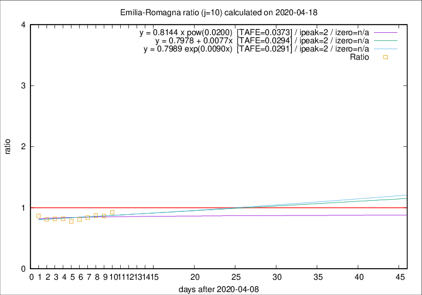

# Emilia-Romagna

Data source: https://raw.githubusercontent.com/pcm-dpc/COVID-19/master/dati-json/dpc-covid19-ita-regioni.json

Delta days analysis (j): 10

Analyses for other values of j for 2020-04-18 are avalable [here](../2020-04-18/README.md)

Analyses for Emilia-Romagna for previous dates are avalable [here](../README.md)

## Fitting 
|fit type|best fit equation|tafe|tfe|ipeak|izero|
|-------|-----|--------|------|---|---|
|linear|y = 0.7978 + 0.0077x  [TAFE=0.0294]|0.0294|0.0013|2|n/a|
|exp|y = 0.7989 exp(0.0090x)  [TAFE=0.0291]|0.0291|0.0008|2|n/a|
|pow|y = 0.8144 x pow(0.0200)  [TAFE=0.0373]|0.0373|0.0010|2|n/a|

## Data
|Date|Daily deaths|Cumulated deaths|Deaths in the last 10 days|Deaths in the 10 days before|ratio|
|----|----------|-----------|-------|--------------------|-----|
|2020-04-18|62|2965|731|791|0.9241|
|2020-04-17|60|2903|723|836|0.8648|
|2020-04-16|55|2843|735|841|0.8740|
|2020-04-15|83|2788|737|877|0.8404|
|2020-04-14|90|2705|728|900|0.8089|
|2020-04-13|51|2615|713|917|0.7775|
|2020-04-12|83|2564|753|919|0.8194|
|2020-04-11|84|2481|749|916|0.8177|
|2020-04-10|81|2397|753|929|0.8105|
|2020-04-09|82|2316|778|898|0.8664|

[Download data as CSV](COVID-19_emilia-romagna_j10_2020-04-18.csv)

Generated April 19th, 2020 at 18:42:39 UTC+0200 with https://github.com/robianc/COVID-19
