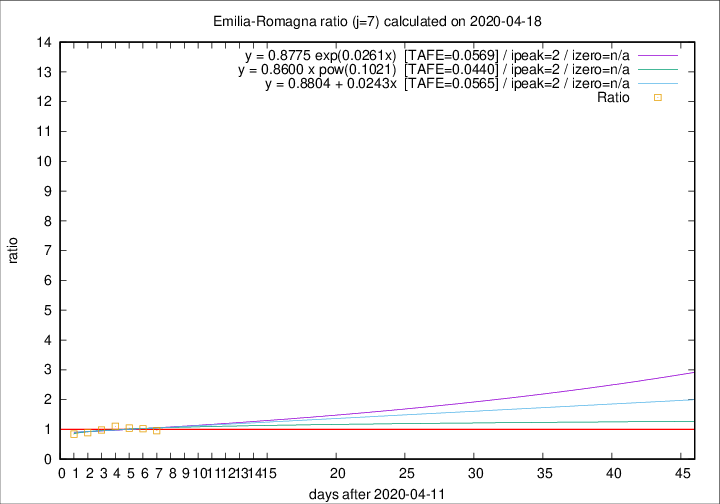

# Emilia-Romagna

Data source: https://raw.githubusercontent.com/pcm-dpc/COVID-19/master/dati-json/dpc-covid19-ita-regioni.json

Delta days analysis (j): 7

Analyses for other values of j for 2020-04-18 are avalable [here](../2020-04-18/README.md)

Analyses for Emilia-Romagna for previous dates are avalable [here](../README.md)

## Fitting 
|fit type|best fit equation|tafe|tfe|ipeak|izero|
|-------|-----|--------|------|---|---|
|linear|y = 0.8804 + 0.0243x  [TAFE=0.0565]|0.0565|0.0048|2|n/a|
|exp|y = 0.8775 exp(0.0261x)  [TAFE=0.0569]|0.0569|0.0025|2|n/a|
|pow|y = 0.8600 x pow(0.1021)  [TAFE=0.0440]|0.0440|0.0016|2|n/a|

## Data
|Date|Daily deaths|Cumulated deaths|Deaths in the last 7 days|Deaths in the 7 days before|ratio|
|----|----------|-----------|-------|--------------------|-----|
|2020-04-18|62|2965|484|504|0.9603|
|2020-04-17|60|2903|506|495|1.0222|
|2020-04-16|55|2843|527|505|1.0436|
|2020-04-15|83|2788|554|502|1.1036|
|2020-04-14|90|2705|525|536|0.9795|
|2020-04-13|51|2615|507|570|0.8895|
|2020-04-12|83|2564|513|608|0.8438|

[Download data as CSV](COVID-19_emilia-romagna_j7_2020-04-18.csv)

Generated April 19th, 2020 at 18:42:39 UTC+0200 with https://github.com/robianc/COVID-19
