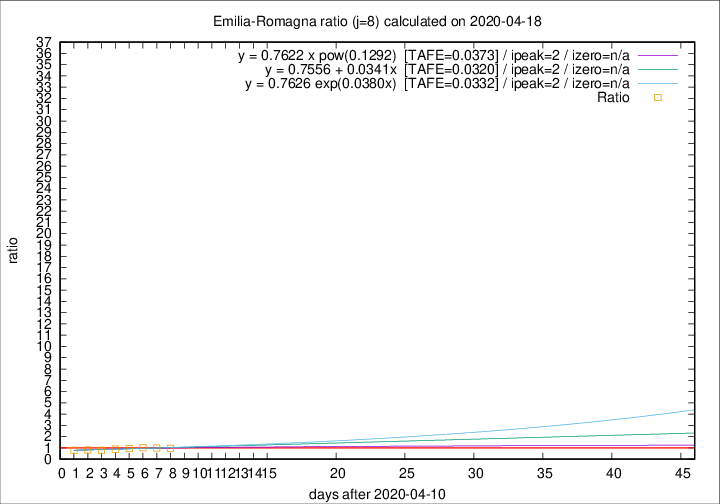

# Emilia-Romagna

Data source: https://raw.githubusercontent.com/pcm-dpc/COVID-19/master/dati-json/dpc-covid19-ita-regioni.json

Delta days analysis (j): 8

Analyses for other values of j for 2020-04-18 are avalable [here](../2020-04-18/README.md)

Analyses for Emilia-Romagna for previous dates are avalable [here](../README.md)

## Fitting 
|fit type|best fit equation|tafe|tfe|ipeak|izero|
|-------|-----|--------|------|---|---|
|linear|y = 0.7556 + 0.0341x  [TAFE=0.0320]|0.0320|0.0021|2|n/a|
|exp|y = 0.7626 exp(0.0380x)  [TAFE=0.0332]|0.0332|0.0012|2|n/a|
|pow|y = 0.7622 x pow(0.1292)  [TAFE=0.0373]|0.0373|0.0011|2|n/a|

## Data
|Date|Daily deaths|Cumulated deaths|Deaths in the last 8 days|Deaths in the 8 days before|ratio|
|----|----------|-----------|-------|--------------------|-----|
|2020-04-18|62|2965|568|586|0.9693|
|2020-04-17|60|2903|587|584|1.0051|
|2020-04-16|55|2843|609|590|1.0322|
|2020-04-15|83|2788|608|642|0.9470|
|2020-04-14|90|2705|597|665|0.8977|
|2020-04-13|51|2615|564|707|0.7977|
|2020-04-12|83|2564|587|710|0.8268|
|2020-04-11|84|2481|579|728|0.7953|

[Download data as CSV](COVID-19_emilia-romagna_j8_2020-04-18.csv)

Generated April 19th, 2020 at 18:42:39 UTC+0200 with https://github.com/robianc/COVID-19
