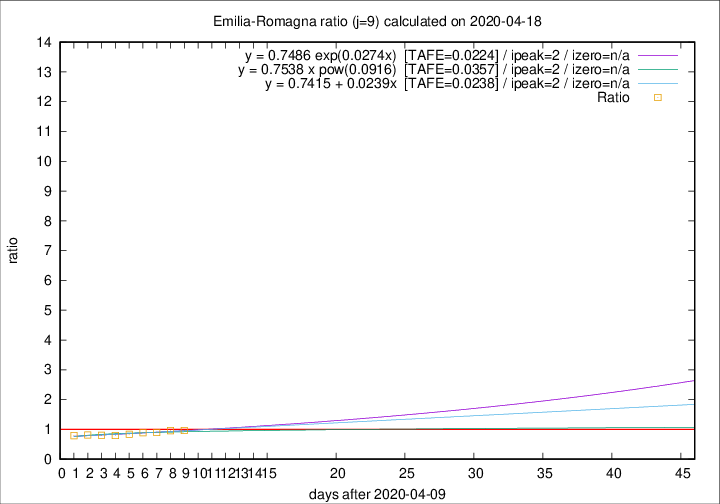

# Emilia-Romagna

Data source: https://raw.githubusercontent.com/pcm-dpc/COVID-19/master/dati-json/dpc-covid19-ita-regioni.json

Delta days analysis (j): 9

Analyses for other values of j for 2020-04-18 are avalable [here](../2020-04-18/README.md)

Analyses for Emilia-Romagna for previous dates are avalable [here](../README.md)

## Fitting 
|fit type|best fit equation|tafe|tfe|ipeak|izero|
|-------|-----|--------|------|---|---|
|linear|y = 0.7415 + 0.0239x  [TAFE=0.0238]|0.0238|0.0005|2|n/a|
|exp|y = 0.7486 exp(0.0274x)  [TAFE=0.0224]|0.0224|0.0001|2|n/a|
|pow|y = 0.7538 x pow(0.0916)  [TAFE=0.0357]|0.0357|0.0009|2|n/a|

## Data
|Date|Daily deaths|Cumulated deaths|Deaths in the last 9 days|Deaths in the 9 days before|ratio|
|----|----------|-----------|-------|--------------------|-----|
|2020-04-18|62|2965|649|672|0.9658|
|2020-04-17|60|2903|669|696|0.9612|
|2020-04-16|55|2843|663|737|0.8996|
|2020-04-15|83|2788|680|764|0.8901|
|2020-04-14|90|2705|654|784|0.8342|
|2020-04-13|51|2615|638|803|0.7945|
|2020-04-12|83|2564|662|825|0.8024|
|2020-04-11|84|2481|670|826|0.8111|
|2020-04-10|81|2397|665|840|0.7917|

[Download data as CSV](COVID-19_emilia-romagna_j9_2020-04-18.csv)

Generated April 19th, 2020 at 18:42:39 UTC+0200 with https://github.com/robianc/COVID-19
