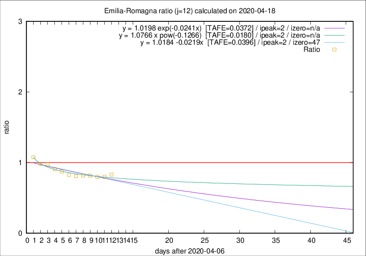

# Emilia-Romagna

Data source: https://raw.githubusercontent.com/pcm-dpc/COVID-19/master/dati-json/dpc-covid19-ita-regioni.json

Estimates in this page were made on 19/4/2020 with data available until 18/04/2020.

## Summary 

### Peak estimate 
|j|linear [TAFE]|exponential [TAFE]|power law [TAFE]|details|
|---|----|-----------|---------|-------|
|7|14/4/2020 [TAFE=0.0565]|14/4/2020 [TAFE=0.0569]|14/4/2020 [TAFE=0.0440]|[analysis](COVID-19_emilia-romagna_j7_2020-04-18.md)|
|8|13/4/2020 [TAFE=0.0320]|13/4/2020 [TAFE=0.0332]|13/4/2020 [TAFE=0.0373]|[analysis](COVID-19_emilia-romagna_j8_2020-04-18.md)|
|9|12/4/2020 [TAFE=0.0238]|12/4/2020 [TAFE=0.0224]|12/4/2020 [TAFE=0.0357]|[analysis](COVID-19_emilia-romagna_j9_2020-04-18.md)|
|10|11/4/2020 [TAFE=0.0294]|11/4/2020 [TAFE=0.0291]|11/4/2020 [TAFE=0.0373]|[analysis](COVID-19_emilia-romagna_j10_2020-04-18.md)|
|11|10/4/2020 [TAFE=0.0346]|10/4/2020 [TAFE=0.0342]|10/4/2020 [TAFE=0.0260]|[analysis](COVID-19_emilia-romagna_j11_2020-04-18.md)|
|12|9/4/2020 [TAFE=0.0396]|9/4/2020 [TAFE=0.0372]|9/4/2020 [TAFE=0.0180]|[analysis](COVID-19_emilia-romagna_j12_2020-04-18.md)|
|13|12/4/2020 [TAFE=0.0500]|12/4/2020 [TAFE=0.0395]|11/4/2020 [TAFE=0.0248]|[analysis](COVID-19_emilia-romagna_j13_2020-04-18.md)|
|14|14/4/2020 [TAFE=0.0665]|13/4/2020 [TAFE=0.0447]|12/4/2020 [TAFE=0.0334]|[analysis](COVID-19_emilia-romagna_j14_2020-04-18.md)|

Best estimator is pow with j=12 (TAFE=0.0180)
Corresponding peak date estimate is 9/4/2020 (ipeak 2)

Peak date range estimate: 9/4/2020 - 16/4/2020

### End estimate 
|j|linear [TAFE/TFE]|exponential [TAFE/TFE]|power law [TAFE/TFE]|details|
|---|----|-----------|---------|-------|
|7|-|-|-|[analysis](COVID-19_emilia-romagna_j7_2020-04-18.md)|
|8|-|-|-|[analysis](COVID-19_emilia-romagna_j8_2020-04-18.md)|
|9|-|-|-|[analysis](COVID-19_emilia-romagna_j9_2020-04-18.md)|
|10|-|-|-|[analysis](COVID-19_emilia-romagna_j10_2020-04-18.md)|
|11|-|-|-|[analysis](COVID-19_emilia-romagna_j11_2020-04-18.md)|
|12|24/5/2020 [TAFE=0.0396]|-|-|[analysis](COVID-19_emilia-romagna_j12_2020-04-18.md)|
|13|-|-|-|[analysis](COVID-19_emilia-romagna_j13_2020-04-18.md)|
|14|-|-|-|[analysis](COVID-19_emilia-romagna_j14_2020-04-18.md)|

Best estimator is linear with j=12 (TAFE=0.0396)
Corresponding end date estimate is 24/5/2020 (izero 47)

End date range estimate: 7/4/2020 - 24/5/2020

Generated April 19th, 2020 at 18:42:39 UTC+0200 with https://github.com/robianc/COVID-19
