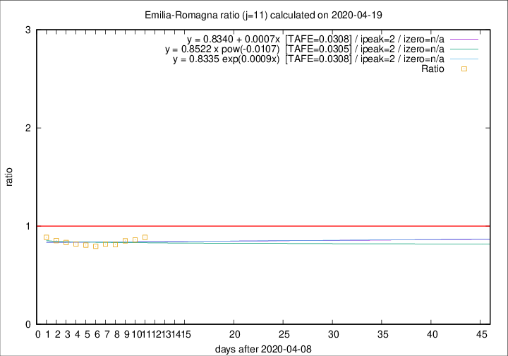

# Emilia-Romagna

Data source: https://raw.githubusercontent.com/pcm-dpc/COVID-19/master/dati-json/dpc-covid19-ita-regioni.json

Delta days analysis (j): 11

Analyses for other values of j for 2020-04-19 are avalable [here](../2020-04-19/README.md)

Analyses for Emilia-Romagna for previous dates are avalable [here](../README.md)

## Fitting 
|fit type|best fit equation|tafe|tfe|ipeak|izero|
|-------|-----|--------|------|---|---|
|linear|y = 0.8340 + 0.0007x  [TAFE=0.0308]|0.0308|0.0010|2|n/a|
|exp|y = 0.8335 exp(0.0009x)  [TAFE=0.0308]|0.0308|0.0008|2|n/a|
|pow|y = 0.8522 x pow(-0.0107)  [TAFE=0.0305]|0.0305|0.0005|2|n/a|

## Data
|Date|Daily deaths|Cumulated deaths|Deaths in the last 11 days|Deaths in the 11 days before|ratio|
|----|----------|-----------|-------|--------------------|-----|
|2020-04-19|58|3023|789|890|0.8865|
|2020-04-18|62|2965|785|913|0.8598|
|2020-04-17|60|2903|795|934|0.8512|
|2020-04-16|55|2843|792|974|0.8131|
|2020-04-15|83|2788|811|992|0.8175|
|2020-04-14|90|2705|803|1010|0.7950|
|2020-04-13|51|2615|804|995|0.8080|
|2020-04-12|83|2564|832|1017|0.8181|
|2020-04-11|84|2481|837|1004|0.8337|
|2020-04-10|81|2397|859|1007|0.8530|
|2020-04-09|82|2316|873|985|0.8863|

[Download data as CSV](COVID-19_emilia-romagna_j11_2020-04-19.csv)

Generated April 19th, 2020 at 18:42:39 UTC+0200 with https://github.com/robianc/COVID-19
