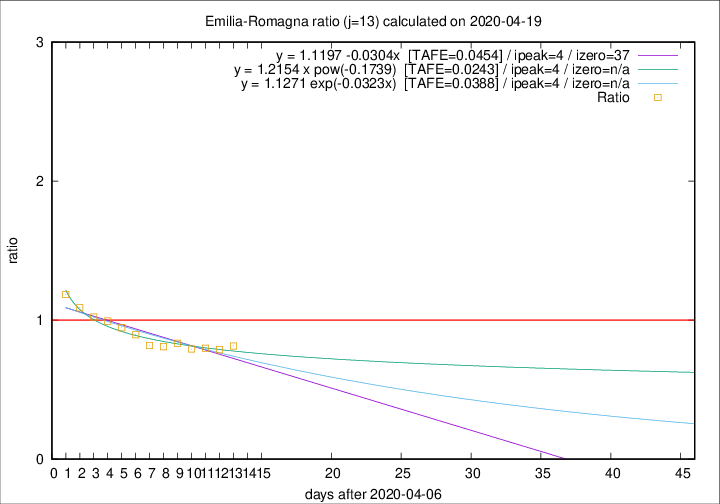

# Emilia-Romagna

Data source: https://raw.githubusercontent.com/pcm-dpc/COVID-19/master/dati-json/dpc-covid19-ita-regioni.json

Delta days analysis (j): 13

Analyses for other values of j for 2020-04-19 are avalable [here](../2020-04-19/README.md)

Analyses for Emilia-Romagna for previous dates are avalable [here](../README.md)

## Fitting 
|fit type|best fit equation|tafe|tfe|ipeak|izero|
|-------|-----|--------|------|---|---|
|linear|y = 1.1197 -0.0304x  [TAFE=0.0454]|0.0454|0.0027|4|37|
|exp|y = 1.1271 exp(-0.0323x)  [TAFE=0.0388]|0.0388|0.0015|4|n/a|
|pow|y = 1.2154 x pow(-0.1739)  [TAFE=0.0243]|0.0243|0.0005|4|n/a|

## Data
|Date|Daily deaths|Cumulated deaths|Deaths in the last 13 days|Deaths in the 13 days before|ratio|
|----|----------|-----------|-------|--------------------|-----|
|2020-04-19|58|3023|915|1123|0.8148|
|2020-04-18|62|2965|914|1159|0.7886|
|2020-04-17|60|2903|926|1161|0.7976|
|2020-04-16|55|2843|941|1187|0.7928|
|2020-04-15|83|2788|977|1171|0.8343|
|2020-04-14|90|2705|973|1201|0.8102|
|2020-04-13|51|2615|971|1186|0.8187|
|2020-04-12|83|2564|1026|1145|0.8961|
|2020-04-11|84|2481|1038|1097|0.9462|
|2020-04-10|81|2397|1053|1060|0.9934|
|2020-04-09|82|2316|1049|1026|1.0224|
|2020-04-08|54|2234|1060|973|1.0894|
|2020-04-07|72|2180|1103|931|1.1847|

[Download data as CSV](COVID-19_emilia-romagna_j13_2020-04-19.csv)

Generated April 19th, 2020 at 18:42:39 UTC+0200 with https://github.com/robianc/COVID-19
